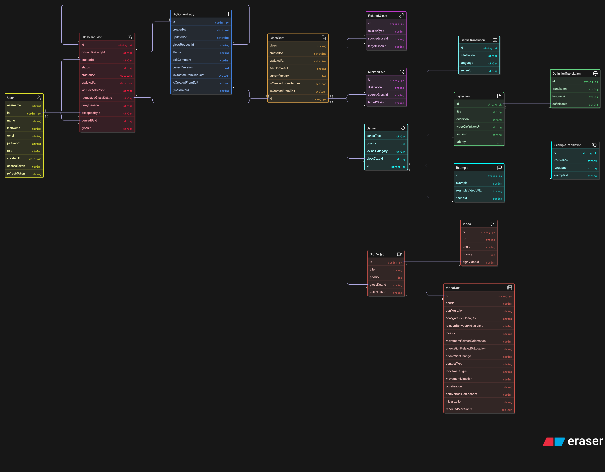

# SignBank Backend

## Table of Contents
- [Setup and Configuration](#setup-and-configuration)
- [Prisma ORM Setup](#prisma-orm-setup)
- [Database Diagram](#database-diagram)
- [API Documentation](#api-documentation)
- [Notes](#notes)


## Setup and Configuration

### Prisma ORM Setup

To initialize and configure Prisma:

```bash
# Deploy database migrations
npx prisma migrate deploy

# Generate Prisma client
npx prisma generate
```


## Database Diagram

The following diagram illustrates the main structure of the database used by the SignBank backend:




# API Documentation

## Authentication (`/auth`)
- `POST /auth/login` — User login (public)
- `POST /auth/register` — User registration (public)
- `POST /auth/refresh` — Refresh JWT tokens (public)
- `POST /auth/logout` — Logout (JWT required)
- `GET /auth/profile` — Get current user profile (JWT required)
- `GET /auth/verify` — Verify JWT token (JWT required)

---

## Users (`/users`) — Admin only
- `GET /users` — List all users
- `PUT /users/:id/role` — Update user role
- `DELETE /users/:id` — Delete user
- `PUT /users/:id/password` — Change user password

---

## Gloss Requests (`/gloss-requests`)
- `GET /gloss-requests/pending` — List all pending requests (admin)
- `GET /gloss-requests/my-requests` — List requests created by current user
- `GET /gloss-requests/:id` — Get a specific gloss request
- `POST /gloss-requests` — Create a new gloss request
- `POST /gloss-requests/:id/accept` — Accept a gloss request (admin)
- `POST /gloss-requests/:id/decline` — Decline a gloss request (admin)
- `POST /gloss-requests/:id/submit` — Submit a gloss request for review

---

## Gloss Data (`/gloss-data`)
- `GET /gloss-data/:id` — Get all data for a gloss
- `PATCH /gloss-data/:id/gloss` — Update gloss name (admin)
- `PATCH /gloss-data/:id/archive` — Archive a gloss (admin)
- `PATCH /gloss-data/:id/unarchive` — Unarchive a gloss (admin)

### Senses
- `POST /gloss-data/:id/senses` — Add a sense
- `PATCH /gloss-data/:id/senses/:senseId` — Update a sense
- `PATCH /gloss-data/:id/senses/reorder` — Reorder senses
- `DELETE /gloss-data/:glossDataId/:senseId` — Delete a sense

### Definitions
- `POST /gloss-data/senses/:senseId/definitions` — Create a definition (admin)
- `PATCH /gloss-data/senses/:senseId/definitions/:definitionId` — Update a definition (admin)

### Examples
- `POST /gloss-data/senses/:senseId/examples` — Create an example (admin)
- `PATCH /gloss-data/examples/:id` — Update an example (admin)
- `DELETE /gloss-data/examples/:id` — Delete an example (admin)

### Videos
- `DELETE /gloss-data/videos/:id` — Delete a video (admin)
- `DELETE /gloss-data/video-data/:id` — Delete video data (admin)

### Translations
- `DELETE /gloss-data/definition-translations/:id` — Delete a definition translation (admin)
- `DELETE /gloss-data/example-translations/:id` — Delete an example translation (admin)

### Relations
- `POST /gloss-data/:id/relations` — Create a related gloss (admin)
- `PATCH /gloss-data/relations/:relationId` — Update a relation (admin)
- `DELETE /gloss-data/relations/:relationId` — Delete a related gloss (admin)

### Minimal Pairs
- `POST /gloss-data/:id/minimal-pairs` — Create a minimal pair (admin)
- `DELETE /gloss-data/minimal-pairs/:pairId` — Delete a minimal pair (admin)

---

## Glosses (`/glosses`)
- `GET /glosses/:id` — Get a gloss by ID

---

## Videos (`/videos`)
- `POST /videos/upload` — Upload a video (JWT required)
- `DELETE /videos/:videoUrl(*)` — Delete a video (JWT required)

---

## Sign Videos (`/sign-videos`)
- `POST /sign-videos` — Create a sign video
- `PUT /sign-videos/:id` — Update a sign video
- `DELETE /sign-videos/:id` — Delete a sign video

---

## Definitions (`/definitions`)
- `POST /definitions/sense/:senseId` — Create a definition
- `PUT /definitions/sense/:senseId/:definitionId` — Update a definition
- `DELETE /definitions/sense/:senseId/:definitionId` — Delete a definition
- `DELETE /definitions/sense/:senseId/:definitionId/video` — Delete a definition video
- `POST /definitions/:definitionId/translations` — Add a translation to a definition
- `PUT /definitions/:definitionId/translations/:translationId` — Update a definition translation
- `DELETE /definitions/:definitionId/translations/:translationId` — Delete a definition translation

---

## Examples (`/examples`)
- `POST /examples/sense/:senseId` — Create an example
- `PUT /examples/:id` — Update an example
- `DELETE /examples/:id` — Delete an example
- `DELETE /examples/:id/video` — Delete an example video

---

## Translations (`/translations`)
- `POST /translations/sense/:senseId` — Create a sense translation
- `PUT /translations/sense/:id` — Update a sense translation
- `DELETE /translations/sense/:id` — Delete a sense translation

---

## Example Translations (`/example-translations`)
- `POST /example-translations/:exampleId` — Create an example translation
- `PUT /example-translations/:id` — Update an example translation
- `DELETE /example-translations/:id` — Delete an example translation

---

## Search (`/search`)
- `GET /search` — Search glosses (query params: query, filter_by, facet_by, page, limit, etc.)

---

## Typesense (`/typesense`)
- `POST /typesense/sync` — Sync all videos to Typesense
- `POST /typesense/sync/init` — Initialize Typesense collection
- `GET /typesense/status` — Get Typesense collection status

---

## Notes
- Most endpoints require JWT authentication; some require admin role.
- Data is generally sent/received as JSON.
- For file uploads, use `multipart/form-data`.
