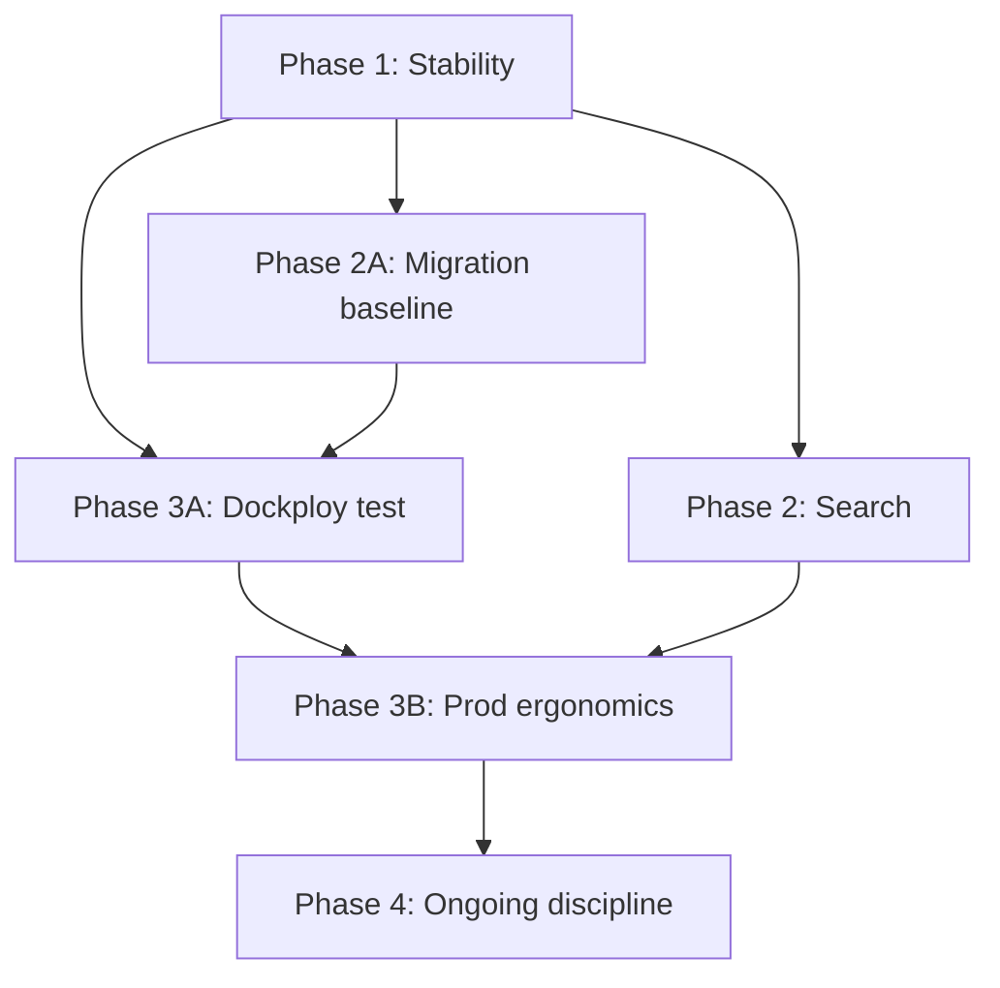

# SignBank Operations Plan

Updated roadmap combining stability fixes, search correctness, Dockploy test deployment, production ergonomics, and safe database migration discipline.

**Last updated:** 2026-06-07  
**Status:** Ready to execute — work top to bottom within each phase.

---

## Goals

| Goal | Success criteria |
|------|------------------|
| Stable test on Dockploy | One git push deploys test; search works after restart |
| Safe schema changes | Adding a nullable column works on test/prod without manual SQL |
| Predictable deploys | Documented checklist; no hardcoded domains; secrets in env |
| Search users can trust | One index model; filters match schema; no wipe on boot |

---

## Architecture target

### Local (unchanged)

`make setup` → full docker-compose-local stack with nginx.

### Test (Dockploy)

Dockploy Traefik handles HTTPS and routing. No outer nginx container.

```
Dockploy (SSL + routing)
├── frontend      static Quasar SPA
├── backend       NestJS — migrate deploy on start
├── postgres      persistent volume
├── typesense     persistent volume
└── dufs          persistent volume (videos)
```

Routes:

| Path | Service |
|------|---------|
| `/` | frontend |
| `/api/*` | backend (strip `/api` prefix in Traefik or backend) |
| `/lscassets/*` | dufs |

### Production (later)

Same pattern as test (Dockploy or manual compose), with stricter backup-before-migrate and no public DB/debug ports.

---

## Dependency overview



**Do not deploy to Dockploy test until Phase 1 Typesense fix is done** — otherwise every restart wipes search and blocks startup on sync failure.

---

## Phase 1 — Stability (1–2 days)

Critical bugs and security gaps. No new features.

### 1.1 Typesense: create-if-missing, never delete on boot

**Files:** `backend/src/typesense/typesense.service.ts`, `backend/src/typesense/typesense.scheduler.ts`

- [ ] Change `initializeCollection()` to:
  - `retrieve()` collection → if exists, return (optionally verify schema version)
  - if 404, `create(videosSchema)`
  - **Remove** unconditional `delete()` call
- [ ] Add separate `recreateCollection()` used only by explicit admin endpoint (destructive)
- [ ] Change `onModuleInit()`:
  - Ensure collection exists
  - Run `syncAllVideos()` in background (do not block app startup on failure — log error)
- [ ] Change midnight cron: full sync **without** delete; or remove midnight job until Phase 2
- [ ] Remove or disable every-minute cron (defer full removal to Phase 2.4)

**Verify:** Restart backend twice; search results remain; API starts even if Typesense is temporarily down.

### 1.2 Environment variables in compose

**Files:** `docker-compose-production.yaml`, `docker-compose-test.yaml`, `docker-compose-local.yaml`, `.env.example`

- [ ] Pass `JWT_SECRET` and `JWT_EXPIRATION` to backend in all compose files
- [ ] Pass `JWT_SECRET` in Dockploy env template (Phase 3A)
- [ ] Remove fallback `'super-secret'` in production — fail if unset (see 1.3)

### 1.3 Validate env on startup

**Files:** `backend/src/main.ts` (or new `backend/src/config/env.validation.ts`)

- [ ] When `NODE_ENV=production`, require:
  - `DATABASE_URL`
  - `JWT_SECRET` (min length 32)
  - `TYPESENSE_API_KEY`
  - `TYPESENSE_HOST`, `TYPESENSE_PORT`
  - `DUFS_URL`
  - `ADMIN_EMAIL`, `ADMIN_PASSWORD` (warn if missing, not fatal after first admin exists)
- [ ] Fix CORS: allow `https://${BASE_URL}` (and `http://` for local), not bare hostname

**Verify:** Backend refuses to start with missing `JWT_SECRET` in production mode.

### 1.4 Fix backup cron

**Files:** `backend/src/backup/backup.config.ts`, `docker-compose-production.yaml`

- [ ] Change default `backupSchedule` from `'* * * * *'` to `'0 2 * * *'` (daily 02:00)
- [ ] Default `enabled: false` when `BACKUP_ENABLED` unset in production (kartoza container handles pg backup)
- [ ] Unify backup host path to `./backend/backups` everywhere (fix prod compose `./backups` mismatch)

**Verify:** No backup process runs every minute in logs.

### 1.5 Protect Typesense admin endpoints

**Files:** `backend/src/typesense/typesense.controller.ts`

- [ ] Add `@UseGuards(JwtGuard, RolesGuard)` and `@Roles(Role.ADMIN)` on controller or each route
- [ ] Rename destructive init to `POST /typesense/sync/recreate` with clear logging

**Verify:** Unauthenticated `POST /typesense/sync/init` returns 401.

### 1.6 Document prod deploy checklist (initial)

**Files:** `docs/DEPLOY.md` (stub — expanded in Phase 3)

- [ ] Prerequisites: server, domain, Dockploy or Docker
- [ ] Required env vars list
- [ ] Create `FileServer/` directories (`gloss-videos`, `example-videos`, `definition-videos`)
- [ ] First deploy vs update deploy
- [ ] Post-deploy smoke tests (login, search, video load)

---

## Phase 2A — Migration baseline (0.5–1 day)

Establish a clean migration history **before** Dockploy test carries real data.

### 2A.1 Audit current state

- [ ] On any existing prod/test DB: run `npx prisma migrate status`
- [ ] Record which migrations are applied vs pending
- [ ] If DB was created from old squashed migrations: **do not** run `init` on it

### 2A.2 Fresh baseline for test (recommended)

- [ ] Provision **empty** Postgres on Dockploy test
- [ ] Deploy backend once → `migrate deploy` applies:
  - `20250101000000_sync_schema_changes` (no-op)
  - `20260321121000_init`
- [ ] Confirm `migrate status` → "Database schema is up to date"
- [ ] Run seed **once** if test needs sample data (`SEED_DB=true` only on first test deploy)

### 2A.3 Freeze migration squash policy

**Files:** `docs/DATABASE.md` (full doc in Phase 4)

- [ ] **Rule:** After test baseline is set, only add forward migrations via `prisma migrate dev`
- [ ] Never edit applied migration SQL
- [ ] Never `db push` on test/prod
- [ ] Practice migration: add one nullable column end-to-end on test before touching prod

### 2A.4 Safe migration playbook (summary)

Document in `docs/DATABASE.md`; follow for every schema change:

```
1. Edit schema.prisma (nullable first for new columns)
2. npx prisma migrate dev --name descriptive_name   # local only
3. Read generated SQL — reject unexpected DROP/RENAME
4. Test locally with seed data
5. Commit migration + application code together
6. Backup database (test: optional; prod: mandatory)
7. Deploy → migrate deploy runs in entrypoint
8. npx prisma migrate status
9. Smoke test
```

**Risky changes (two-step):**

| Change | Approach |
|--------|----------|
| NOT NULL column | Add nullable → backfill → set NOT NULL in second migration |
| Rename field | `@map` or add new + copy + drop old in separate releases |
| Enum value removal | Never remove; deprecate in app first |
| Unique constraint | Dedupe data before migration |

---

## Phase 2 — Search correctness (2–3 days)

Depends on Phase 1.1 (stable collection).

### 2.1 Unify index model — one document per gloss

**Decision:** One Typesense document per **published gloss** (`DictionaryEntry` + `GlossData`), not per video angle.

**Files:** `typesense.config.ts`, `typesense.service.ts`, `typesense.subscriber.ts`, `types/video-index.type.ts`

- [ ] Document ID = `glossData.id` (or `dictionaryEntry.id`)
- [ ] Include primary video URL (lowest-priority `SignVideo` + first `Video`)
- [ ] Include phonology fields from that sign video's `VideoData`
- [ ] Update `syncAllVideos()` and subscriber to same shape
- [ ] Remove conflicting `createVideoDocument` ID logic (`signVideo.id` vs `video.id`)

### 2.2 Add missing schema fields

**Files:** `backend/src/typesense/typesense.config.ts`

- [ ] Add to Typesense schema:
  - `glossId` (string, facet optional)
  - `lexicalCategory` (string, facet) — from primary sense
  - `senseTitle` (string, optional)
- [ ] Populate in sync/subscriber from primary sense (lowest `priority`)
- [ ] Remove or fix frontend filters that reference non-existent fields (`GlossSearch.vue` lexicalCategory filter)

**Verify:** Filter by `lexicalCategory` and `hands` returns expected results.

### 2.3 Wire event emits on mutations

**Files:** `sign-videos.service.ts`, `gloss-data.service.ts`, `gloss-requests.service.ts`, modules importing `EventEmitter2`

- [ ] Emit `gloss.updated` / `gloss.deleted` on publish, archive, accept request
- [ ] Emit on sign video create/update/delete
- [ ] Refactor `TypesenseSubscriber` to handle gloss-level events (upsert/delete one doc)
- [ ] Remove dead `video.created` handlers if switching to gloss-level events

**Verify:** Edit gloss in admin UI → search reflects change within seconds (no wait for cron).

### 2.4 Remove periodic Typesense crons

**Files:** `backend/src/typesense/typesense.scheduler.ts`

- [ ] Delete every-minute job
- [ ] Optional: keep weekly reconcile cron (`syncAllVideos` without delete) as safety net
- [ ] Keep manual `POST /typesense/sync` for admin recovery

---

## Phase 3A — Dockploy test deployment (2–3 days)

Depends on Phase 1 and Phase 2A.

### 3A.1 Create Dockploy compose file

**New file:** `docker-compose.dockploy.yaml`

- [ ] Services: `backend`, `frontend`, `postgres`, `typesense`, `dufs` — **no nginx**
- [ ] Backend listens on `3000` (update `main.ts` / Dockerfile — drop port 443 + `NET_BIND_SERVICE` for this file)
- [ ] Named volumes: `postgres_data`, `typesense_data`, `fileserver_data`
- [ ] Do **not** publish postgres port `5432` to host
- [ ] Do **not** publish debug port `9229`
- [ ] `SEED_DB=true` only as one-time env flag in Dockploy UI
- [ ] All secrets via Dockploy environment (not committed)

### 3A.2 Backend entrypoint for Dockploy

**Files:** `backend/docker-entrypoint.sh`, `backend/Dockerfile.prod`

- [ ] Keep: `prisma migrate deploy` → `exec start:prod`
- [ ] Optional seed: only when `SEED_DB=true`
- [ ] Ensure `prisma generate` runs at image build time (Dockerfile)

### 3A.3 Frontend for Dockploy

**Files:** `frontend/Dockerfile.prod`, `frontend/default.conf`

- [ ] Fix entrypoint: save env-replace script, set `CMD` (Phase 3B.4)
- [ ] Build with `VITE_BASE_URL=test.yourdomain.com`
- [ ] Serve on port 80

### 3A.4 Dockploy routing config

In Dockploy UI (document values in `docs/DEPLOY.md`):

- [ ] Domain: `test.yourdomain.com`
- [ ] Service `frontend` → path `/`
- [ ] Service `backend` → path `/api` with strip prefix (or configure backend global prefix — prefer strip at proxy)
- [ ] Service `dufs` → path `/lscassets`
- [ ] SSL: Let's Encrypt via Dockploy

### 3A.5 Test deploy checklist

- [ ] Empty DB → first deploy → migrations apply → admin created
- [ ] Login as admin
- [ ] Search returns seeded glosses
- [ ] Upload/view video via `/lscassets/...`
- [ ] Restart backend container → search still works (Phase 1 verification)
- [ ] Apply one test migration (nullable column) → redeploy → success

---

## Phase 3B — Production ergonomics (2–3 days)

Can parallel Phase 3A once patterns are proven on test.

### 3B.1 Parameterize nginx (if keeping manual prod compose)

**Files:** `nginx/nginx.prod.conf/default.conf`, `scripts/render-nginx-config.sh`

- [ ] Template with `${SERVER_NAME}` and `${BASE_URL}`
- [ ] Render at deploy time via `envsubst`
- [ ] Add HTTP → HTTPS redirect on port 80
- [ ] Remove hardcoded `rdonadeu.dev`

*Skip if prod also moves to Dockploy — Traefik replaces this.*

### 3B.2 Deploy scripts

**New files:** `scripts/deploy.sh`, `scripts/prod-bootstrap.sh`

`prod-bootstrap.sh` (once per server):

- [ ] Check Docker / Dockploy installed
- [ ] Create `FileServer/` subdirs
- [ ] Copy `.env.example` → `.env` prompt
- [ ] Generate or point to SSL (if not Dockploy)

`deploy.sh` (each release):

- [ ] `git pull`
- [ ] Pre-deploy: `pg_dump` backup (prod) or prompt to confirm (test)
- [ ] `docker compose -f docker-compose.dockploy.yaml build`
- [ ] `docker compose up -d`
- [ ] Wait for backend health
- [ ] `docker compose exec backend npx prisma migrate status`
- [ ] Curl smoke tests: `/api/auth/verify`, `/api/search?query=*`

### 3B.3 Harden production compose

**Files:** `docker-compose-production.yaml`

- [ ] Remove `5432:5432` postgres port mapping
- [ ] Remove `9229:9229` debug port mapping
- [ ] Add `JWT_SECRET`, `JWT_EXPIRATION`
- [ ] Align with `docker-compose.dockploy.yaml` patterns where possible

### 3B.4 Fix frontend prod Dockerfile entrypoint

**Files:** `frontend/Dockerfile.prod`

- [ ] Write `/docker-entrypoint.sh` properly (not `RUN echo`)
- [ ] `ENTRYPOINT ["/docker-entrypoint.sh"]`
- [ ] Replace `VITE_BASE_URL_PLACEHOLDER` at container start if still needed

### 3B.5 GitHub Actions (optional)

**New file:** `.github/workflows/build.yml`

- [ ] Build backend + frontend images on push to `main`
- [ ] Push to GHCR
- [ ] Dockploy pulls tagged images (faster deploys than build-on-server)

---

## Phase 4 — Migrations discipline (ongoing)

### 4.1 Full DATABASE.md

**File:** `docs/DATABASE.md`

- [ ] Dev workflow (`migrate dev`)
- [ ] Test/prod workflow (`migrate deploy`)
- [ ] Backup before migrate (commands for Docker/Dockploy)
- [ ] Verify: `migrate status`
- [ ] Rollback strategy (restore dump — Prisma has no down migrations)
- [ ] Failed migration mid-deploy: diagnose `_prisma_migrations` table, `migrate resolve`
- [ ] Enum change notes for SignBank's large phonology enums
- [ ] Squash policy: never after baseline

### 4.2 Integrate migrate status into deploy

**Files:** `scripts/deploy.sh`, `backend/docker-entrypoint.sh`

- [ ] `deploy.sh` runs `migrate status` after up; exit non-zero if pending failed migrations
- [ ] Entrypoint logs migration output clearly

### 4.3 Per-release checklist (copy into PR template or DEPLOY.md)

```
□ Migration SQL reviewed for DROP/RENAME
□ Tested on local DB with data (not empty DB only)
□ Applied on Dockploy test
□ Backup taken (prod)
□ Code + migration in same deploy
□ Smoke test passed
```

---

## Execution order (recommended sprints)

### Sprint 1 — Unblock test (Week 1)

| Day | Tasks |
|-----|-------|
| 1 | Phase 1.1–1.3 (Typesense boot, JWT, env validation) |
| 2 | Phase 1.4–1.6 (backup cron, auth on typesense, DEPLOY stub) |
| 3 | Phase 2A (migration baseline on empty test DB) |
| 4 | Phase 3A.1–3A.3 (dockploy compose + Dockerfiles) |
| 5 | Phase 3A.4–3A.5 (Dockploy routing + first test deploy) |

**Sprint 1 exit:** Test environment live on Dockploy; restart-safe; migrations apply cleanly.

### Sprint 2 — Search + prod path (Week 2)

| Day | Tasks |
|-----|-------|
| 1–2 | Phase 2.1–2.2 (unified index + schema fields) |
| 3 | Phase 2.3–2.4 (events, remove crons) |
| 4 | Phase 3B.2–3B.4 (deploy scripts, Dockerfile fix) |
| 5 | Phase 4.1–4.2 (DATABASE.md, migrate status in deploy) |

**Sprint 2 exit:** Search filters work; incremental index updates; documented deploy + migration process.

### Sprint 3 — Polish (optional)

- Phase 3B.1 or full prod on Dockploy
- Phase 3B.5 GitHub Actions
- Phase 3B.3 prod compose hardening

---

## What we are explicitly not doing

| Idea | Reason |
|------|--------|
| Drop Docker for test | Dockploy requires containers; compose keeps parity |
| `prisma db push` on test/prod | Breaks migration history |
| Delete Typesense collection on schedule | Causes search outages |
| Squash migrations again | Breaks any DB created from current chain |
| Bare-metal nginx without containers | More ops burden; no benefit for this stack |

---

## File index (created or modified by this plan)

| File | Phase |
|------|-------|
| `backend/src/typesense/typesense.service.ts` | 1.1, 2.1 |
| `backend/src/typesense/typesense.scheduler.ts` | 1.1, 2.4 |
| `backend/src/typesense/typesense.controller.ts` | 1.5 |
| `backend/src/typesense/typesense.config.ts` | 2.2 |
| `backend/src/main.ts` | 1.3 |
| `backend/src/backup/backup.config.ts` | 1.4 |
| `docker-compose-production.yaml` | 1.2, 3B.3 |
| `docker-compose.dockploy.yaml` | 3A.1 **new** |
| `docs/DEPLOY.md` | 1.6, 3A.4 |
| `docs/DATABASE.md` | 2A.3, 4.1 **new** |
| `scripts/deploy.sh` | 3B.2 **new** |
| `scripts/prod-bootstrap.sh` | 3B.2 **new** |
| `frontend/Dockerfile.prod` | 3A.3, 3B.4 |

---

## Next action

Start **Phase 1.1** (Typesense create-if-missing). It is the highest-risk blocker for any test deploy.

When ready to implement, say: *"Proceed with Phase 1"* or *"Start Sprint 1"*.
