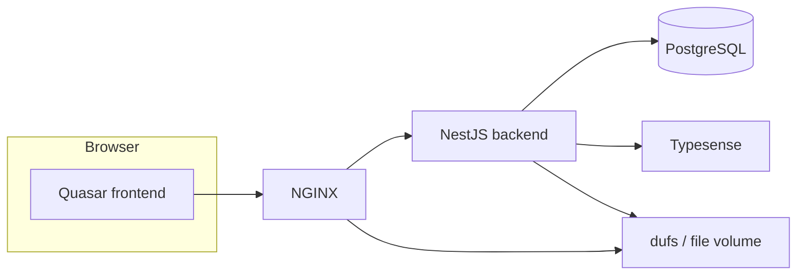

# SignBank — Application structure

This document describes how the repository is organized, how major services connect, and where to look in the code for each concern.

## High-level architecture

SignBank is a **monorepo** with a **Quasar (Vue 3)** frontend, a **NestJS** API, **PostgreSQL** for persistence, **Typesense** for search, **NGINX** as reverse proxy/TLS termination, and **dufs** for serving uploaded files. Orchestration is done with **Docker Compose** (local, test, and production variants at the repo root).

- **Frontend** talks to the API over HTTP (Axios); search uses the backend’s search endpoints, which query Typesense.
- **Backend** owns business rules, authentication (JWT), Prisma/PostgreSQL data, and indexing/sync with Typesense.
- **Videos and static uploads** are stored on disk and exposed via **dufs** (see `DUFS_URL` / compose configuration).

For environment variables, compose files, and first-time DB setup, see the root [README.md](../README.md).

---

## Repository layout (top level)

| Path | Role |
|------|------|
| `frontend/` | Quasar SPA: search UI, gloss detail, requests workflow, admin screens |
| `backend/` | NestJS API, Prisma schema & migrations, scheduled jobs (e.g. backup) |
| `nginx/` | Reverse proxy config and TLS cert mount points |
| `typesense/` | Typesense data directory (volume) |
| `docker-compose-local.yaml` | Local dev stack |
| `docker-compose-production.yaml` | Production-oriented stack |
| `docker-compose-test.yaml` | Test stack |
| `schema.env` | Example env template (copy to `.env` at root) |

---

## Backend (`backend/`)

### Runtime entry

- **`src/main.ts`** — Bootstraps NestJS, enables CORS against `BASE_URL`, registers global `ValidationPipe`, listens on `PORT`.
- **`src/app.module.ts`** — Root module: wires feature modules and `ScheduleModule` for cron-style tasks.

### Feature modules (NestJS)

Each domain typically has `*.module.ts`, `*.controller.ts`, and `*.service.ts` under `src/<feature>/`:

| Module | Responsibility |
|--------|----------------|
| `AuthModule` | Login, register, JWT refresh, profile |
| `UsersModule` | User listing and admin operations (roles, passwords) |
| `PrismaModule` | Database client |
| `GlossesModule` / `GlossDataModule` | Published gloss identity and rich gloss payload (senses, definitions, examples, relations, minimal pairs, videos) |
| `GlossRequestsModule` | Workflow for proposed entries: draft → submit → accept/decline |
| `VideosModule` / `SignVideosModule` | Upload and sign-video records |
| `SearchModule` | Search API backed by Typesense |
| `TypesenseModule` | Collection init/sync/status |
| `SensesModule`, `DefinitionsModule`, `ExamplesModule`, `TranslationsModule`, `ExampleTranslationsModule` | CRUD slices used by gloss editing |
| `BackupModule` | Scheduled DB backup logic (see `src/backup/`) |

HTTP route inventory and auth notes: [backend/README.md](../backend/README.md).

### Data layer

- **`prisma/schema.prisma`** — Single source of truth for tables, enums (roles, request status, phonology enums, lexical categories, relation types, etc.), and relations.
- **`prisma/migrations/`** — Schema history.

### Docker

- **`Dockerfile.local`** / **`Dockerfile.prod`** — Image builds; entry scripts may run migrations before start (see `docker-entrypoint.sh`).

---

## Frontend (`frontend/`)

### Routing

- **`src/router/routes.ts`** — Declares all top-level paths and which page component loads.
- **`src/router/index.ts`** — Vue Router factory (history mode follows Quasar env).

Main routes:

- `/` and `/search` → search
- `/gloss/:gloss` → published gloss detail
- `/my-requests` (+ `create`, `edit/:id`, `view/:id`) → contributor request workflow
- `/confirm-requests` (+ `review/:id`) → admin review queue
- `/user-management` → admin users

Layout: **`src/layouts/MainLayout.vue`** wraps pages with **`HeaderComponent`** (drawer nav, login/logout).

### App bootstrap

- **`src/boot/axios.ts`** — API base URL and interceptors for authenticated calls.
- **`src/boot/auth.ts`** — Auth-related startup if present.
- **`src/boot/i18n.ts`** — i18n setup.

### State and API

- **`src/stores/user.store.ts`** — Current user, JWT tokens, `isAdmin` / `isLoggedIn`.
- **`src/services/api.ts`** — Typed wrappers around REST endpoints.
- **`src/services/search.service.ts`** — Search query helpers.

### UI organization

- **`src/pages/``** — One primary screen per route (search, gloss, requests, admin).
- **`src/components/GlossDetail/`** — Large gloss “document” UI: header, senses, definitions, examples, videos, phonology, related glosses, minimal pairs.
- **`src/components/Search/`** — Search bar, filters, result cards, phonology filters.
- **`src/components/UserManagement/`** — Admin user table and dialogs.
- **`src/i18n/`** — Locale bundles (e.g. `en-US`, `ca-ES`, `es-ES`).

Cross-cutting: **`src/types/`** (models, API DTOs, enums), **`src/utils/`** (validation, phonology options, URLs), **`src/composables/`**, **`src/hooks/useAuthentication.ts`**.

More detail: [frontend/README.md](../frontend/README.md).

---

## Cross-cutting concerns

| Concern | Where it lives |
|---------|----------------|
| Authentication | Backend `AuthModule`; frontend `useAuthentication`, `user.store`, Axios |
| Authorization | Backend guards (per-route); UI hides admin items in `HeaderComponent` (`isAdmin`) |
| Search index | `TypesenseModule` + Typesense container; frontend uses search API |
| File uploads | Backend video upload endpoints; files served via **dufs** |
| Scheduled backups | Docker `db-backup` service (Postgres dumps) + optional `BackupModule` in API |
| CI / release | `.github/workflows/` |

---

## Related reading

- [Product and user guide](./product-and-user-guide.md) — What the app is for and how people use it.
- [Backend API & DB diagram](../backend/README.md)
- [Frontend file map](../frontend/README.md)
