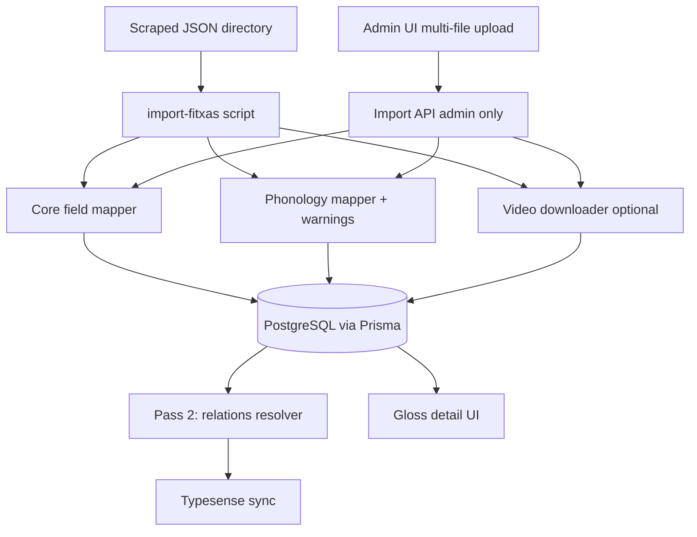

# SignBank — Fitxas (scraped data) import plan

Technical implementation plan for integrating dictionary cards scraped from legacy FITXES (Word documents) into SignBank.

> **Source of truth for field decisions and schema v2 format:** [`fitxas-import-requirements.md`](fitxas-import-requirements.md)

**Last updated:** 2026-06-19  
**Status:** Planning — no import pipeline implemented yet  
**Sample files:** [`Examples/`](../Examples/) (`menjar.json`, `cervesa.json`, `bessons-1d.json`, `bessons.json`)

---

## Goals

| Goal | Success criteria |
|------|------------------|
| Bulk ingest scraped JSON | Script imports all fitxas without manual DB edits |
| Preserve traceability | Each imported gloss maps back to source `gloss_id` |
| Safe first run | Dry-run mode reports gaps before writing to DB |
| Searchable published entries | Imported glosses appear in Typesense after sync |
| Data quality visibility | Warnings logged for unmapped phonology, missing relation targets, etc. |

---

## Current state

### SignBank model (what exists today)

Core schema: `backend/prisma/schema.prisma`. Entity graph:

```
GlossData
├── GlossTranslation[]
├── Definition[] (+ DefinitionTranslation[])
├── Example[] (+ ExampleTranslation[])
├── SignVideo[]
│   ├── VideoData (phonology enums)
│   └── Video[] (url, angle)
├── RelatedGloss[] (source/target)
├── MinimalPair[] (source/target)
└── DictionaryEntry? (published)
```

- **Draft workflow:** `GlossRequest` + `GlossData` → admin accept → `DictionaryEntry`
- **Seed data:** `backend/prisma/seed.ts` — hand-written demo glosses only
- **No import path:** `Examples/` is reference JSON on disk; `backend/src/examples/` is the *usage examples* CRUD module (unrelated)
- **Partial enum infrastructure:** `backend/src/import/fitxa-enum-resolver.ts` + `fitxa-enum-mappings.json` (out of sync with schema v2 field names — see requirements doc)

For fitxa JSON format, field decisions, and proposed schema changes, see [`fitxas-import-requirements.md`](fitxas-import-requirements.md).

---

## Hard problems

### 1. Phonology mapping (largest effort)

Scraped phonology uses **Catalan human labels**. SignBank stores **strict Prisma enums** (`Hand`, `HandConfiguration`, `Location`, etc.).

Schema v2 example (`cervesa.json`):

```json
"nombre_mans": "2a",
"configuracio_ma_dominant": "B (B)",
"configuracio_ma_no_dominant": "0_SSI (O)",
"relacio_articuladors_ma_dominant": "Damunt",
"relacio_articuladors_ma_no_dominant": "Sota"
```

**Required:**

- Per-field lookup tables (scraped label → enum value or **catalog entry**)
- Per-hand configuration on `VideoData` (dominant + non-dominant)
- **Extensible hand configuration catalog** — ability to add new configurations without enum migration each time (see [requirements §3.4](fitxas-import-requirements.md#34-phonology-vocabulary--extensibility--mapping))
- `nombre_mans` → `Handedness` enum (distinct from `Hand`)
- **UI:** phonology table with row labels + main hand + non-dominant hand columns (see [requirements §3.3](fitxas-import-requirements.md#phonology-table-ui--v1))
- Fallback to `EMPTY` when unknown (interim until catalog supports create-on-import)
- Warning report per gloss
- Iterative expansion as new vocabulary appears in full dataset

**Compound signs** (`bessons-1d.json`) — see [requirements §2.5](fitxas-import-requirements.md#25-compound-signs-domain-model):

- Compound glosses have **no top-level phonology** (`phonology: null`); phonology is derived from ordered components
- 2–3 components per compound, in fixed order (e.g. `GERMÀ` + `SEGON` → `BESSONS-1d`)
- Each component is either a **linked gloss** (`comp_id` → another entry) or an **inline morpheme** (`comp_id: null`, phonology stored on the part)
- A linked component may itself be a compound (nested; expected max ~2 levels)
- UI: columnar phonology display, one column per component in order

### 2. Videos

Scraped `video_urls[]` point to **Google Drive**, not Dufs paths like `gloss-videos/foo.mp4`.

Import pipeline:

1. Download from Drive (or accept pre-exported local `.mp4` files)
2. Upload via `VideosService` → Dufs (`gloss-videos/`)
3. Store relative path in `Video.url`

Until videos are processed, entries can import with placeholder or empty video (blocks gloss-request validation but not direct admin publish).

### 3. Relations (two-pass import)

`minimal_pairs` and `related_signs` reference gloss **strings** (e.g. `"EMPASSAR-SE"`, `"CONSUM"`). Targets may not exist during pass 1.

**Strategy:**

1. **Pass 1:** Create all `GlossData`, definitions, translations, videos
2. **Pass 2:** Resolve `RelatedGloss` and `MinimalPair` by gloss name; log unresolved references

Edge cases:

- Target gloss not in import batch → warning + skip or deferred queue
- Ambiguous gloss names (homonyms) → may need `externalId` or disambiguation rules

### 4. Definition parsing

`MENJAR` has multiple senses in `definitions[]`:

```
"Verb- Dur un aliment sòlid a la boca..."
"Nom- Producte natural o elaborat..."
```

Each array entry → one `Definition` row. Parse optional prefix → `lexicalCategory`; strip prefix from text. Top-level fitxa `lexical_category` is **not imported**. See [requirements §2.3](fitxas-import-requirements.md#23-definitions-and-lexical-category).

### 5. Publication workflow

| Option | Pros | Cons |
|--------|------|------|
| **A. Direct publish** | Fast; entries immediately searchable | No review; bad data goes live |
| **B. Import as drafts** | `GlossRequest` in `NOT_COMPLETED`; admin reviews | Slower; manual accept per entry |
| **C. Hybrid** | Publish clean rows; flag warnings for review | More complex logic |

**Recommendation:** Start with **B or C** given data quality signals in samples (`???? (potser són iguals)`, incomplete phonology nulls).

Submit validation (`backend/src/utils/gloss-validation.ts`) requires at least one video — imported drafts may fail submit until video gaps are fixed.

---

## Architecture



CLI script (Phase 2–3) and admin UI (Phase 6) share the same import service logic.

**Proposed script location:** `backend/scripts/import-fitxas.ts`

**CLI flags (proposed):**

| Flag | Purpose |
|------|---------|
| `--dir <path>` | Directory of JSON files (default: `Examples/`) |
| `--dry-run` | Validate and print report; no DB writes |
| `--limit N` | Process first N files (testing) |
| `--with-videos` | Download Drive URLs and upload to Dufs |
| `--publish` | Create `DictionaryEntry` as `PUBLISHED` |
| `--draft` | Create `GlossRequest` as `NOT_COMPLETED` (default) |
| `--upsert` | Update existing rows matched by `externalId` |

---

## Phased implementation

See [`fitxas-import-requirements.md` §5](fitxas-import-requirements.md#5-implementation-phases) for scope per phase. Summary:

### Phase 1 — Schema migration

- Traceability: `externalId`, `sourceDocPath`
- Compounds: `isCompound`, `CompoundPart[]`
- Semantic categories: `Category` model + many-to-many with `GlossData`
- Gloss metadata: `iconicity`, `valency`, `KeySignGroup[]` (key signs)
- Morphology: `SimultaneousMorphology[]`, `AbbreviatedMorphology[]`, `namedEntity`
- Definitions: make `lexicalCategory` optional on `Definition` (`LexicalCategory?`)
- Metadata storage: corpus forms, categories, iconicity, valency, signes claus, named entity, simultaneous morphology
- Per-hand phonology + `Handedness` enum on `VideoData`
- Hand configuration catalog (`HandConfigurationEntry`) — migrate from closed `HandConfiguration` enum (§3.4)
- Align frontend `RelationType` in `frontend/src/types/models.ts` with backend (add `HOMONYM`, `VARIANT`)

### Phase 2 — Dry-run importer

**Deliverables:**

- TypeScript interface for schema v2 (single-entry and bundle layouts)
- `readFitxasDir()` — load and validate JSON files
- Mappers: definitions, translations, lexical category, phonology (per-hand), relations, compounds
- `importFitxa()` — Prisma create with nested writes
- `--dry-run` output: per-file summary + warnings
- Idempotent upsert by `externalId`

**Output example (dry-run):**

```
menjar.json
  gloss: MENJAR
  definitions: 2
  translations: en, es
  phonology warnings: 1 (orientacio_moviment: "Punta dels dits (finger tips)")
  relations deferred: 1 (CONSUM)
  stored metadata: corpus_forms(4), categories(1), signes_claus(2)
  skipped: synonyms, occurrences, lexical_category
  skipped: occurrences
  video: skipped (no --with-videos)
```

### Phase 3 — Videos & relations

- Google Drive download helper (or document manual pre-export workflow)
- Upload integration with `VideosService` / Dufs
- Pass 2: `RelatedGloss` + `MinimalPair` resolution by gloss name
- Unresolved relations report (`import-warnings.json`)

### Phase 4 — UI (gloss detail + edit/create rework)

Extend read-only detail **and** the edit/create flow. See [requirements §3.6](fitxas-import-requirements.md#36-gloss-edit--create-pages-ui--major-rework-planned).

**Read-only detail:** compound & morphology table, two-hand phonology table, key signs, iconicity, valency, semantic category chips.

**Edit/create:** optional lexical category, categories combobox, phonology two-hand editor, compound & morphology block, validation for compound glosses.

**Prerequisites:** Phase 1 schema + extended gloss-data API/DTOs.

### Phase 5 — Production run

1. Dry-run on full scraped dataset → review warning report
2. Fix phonology mapper gaps
3. Full import on staging environment
4. Spot-check ~20 entries (simple, multi-sense, compound, relations)
5. Typesense sync
6. Production import with backup first

### Phase 6 — Admin import UI (deferred — complex)

Admin-only page for uploading and importing fitxa JSON files through the browser. **Not started** — requires dedicated implementation with active prompting.

See [requirements §3.5](fitxas-import-requirements.md#35-admin-fitxa-import-page-ui--planned-complex) for scope, dependencies, and suggested implementation slices.

**Prerequisites:** Phase 1–3 (schema + import service/API), admin auth on endpoints.

**Likely deliverables:**

- `POST /import/fitxas/dry-run` and `POST /import/fitxas` (or equivalent) — admin guarded
- Vue page: multi-file upload, dry-run results, commit, per-file warning/error report
- Route registered under admin navigation only

---

## Open decisions

| # | Question | Status | Owner |
|---|----------|--------|-------|
| 1 | Publication workflow | Open | SignBank team |
| 2 | Video source (Drive vs pre-exported) | Open | SignBank team |
| 3 | Categories filter UX | Open | SignBank team |
| 4 | `morfologia_abreujada` | Open | Ask Lali |
| 5 | `nombre_mans` vs `Hand` enum | Open | Technical |

Resolved decisions (compounds, corpus forms, occurrences, semantics, etc.) are in [`fitxas-import-requirements.md`](fitxas-import-requirements.md).

---

## Next step

Build **Phase 2 dry-run importer** against schema v2 files in `Examples/`:

- Maps everything that fits the current + proposed schema
- Prints warnings for phonology, missing relation targets, and skipped fields
- Does **not** write to the database

This produces a concrete gap report before schema migration.

---

## Related docs & code

| Resource | Path |
|----------|------|
| **Requirements (field decisions)** | [`fitxas-import-requirements.md`](fitxas-import-requirements.md) |
| Meeting agenda (raw notes) | [`fitxas-import-meeting-agenda.md`](fitxas-import-meeting-agenda.md) |
| ENUM mapping workflow | [`fitxas-enum-mappings.md`](fitxas-enum-mappings.md) |
| ENUM reference | [`fitxas-import-enums-reference.md`](fitxas-import-enums-reference.md) |
| Gap analysis | [`fitxas-mapping-analysis.json`](fitxas-mapping-analysis.json) |
| Prisma schema | `backend/prisma/schema.prisma` |
| Enum resolver | `backend/src/import/fitxa-enum-resolver.ts` |
| Gloss validation | `backend/src/utils/gloss-validation.ts` |
| Video upload | `backend/src/videos/videos.service.ts` |
| Typesense sync | `backend/src/typesense/typesense.service.ts` |
| Sample scraped data | `Examples/*.json` |

Regenerate ENUM reference: `node backend/scripts/generate-enum-reference.js`
