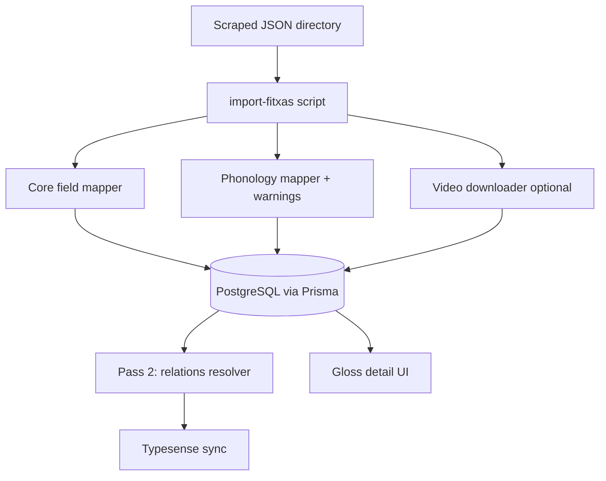

# SignBank — Fitxas (scraped data) import plan

Plan for integrating dictionary cards scraped from legacy FITXES (Word documents) into SignBank. Sample data lives in [`Examples/`](../Examples/).

**Last updated:** 2026-06-17  
**Status:** Planning — no import pipeline implemented yet  
**Sample files:** `0001_menjar.json`, `0764_01_cervesa.json`, `1420_02_bessons-1d.json`

---

## Scope decisions (product)

Fields from the scraped JSON classified by priority for SignBank v1.

### Confirmed for v1 — schema + UI required

| JSON field | Why it matters | Example |
|------------|----------------|---------|
| **`morfologia_sequencial`** | Explains how compound signs are built from ordered morphemes. Essential for understanding composed signs. | `BESSONS-1d` → `compost_1: "GERMÀ"`, `compost_2: "SEGON"` (“two brothers” = twins) |
| **`is_compound`** | Boolean flag to distinguish simple signs from compounds in search and gloss detail. | `true` for `BESSONS-1d`, `false` for `MENJAR` |
| **`compound_signs`** | Ordered list of gloss morphemes; pairs with sequential morphology for display. | `["GERMÀ", "SEGON"]` |

**Proposed schema (Phase 1):**

```prisma
model GlossData {
  // ... existing fields
  isCompound              Boolean  @default(false)
  sequentialMorphology    SequentialMorphology?
  compoundParts           CompoundPart[]   // ordered; gloss refs + optional phonology later
}

model SequentialMorphology {
  id          String    @id @default(uuid())
  glossDataId String    @unique
  glossData   GlossData @relation(fields: [glossDataId], references: [id], onDelete: Cascade)
  part1       String?   // maps morfologia_sequencial.compost_1
  part2       String?   // maps morfologia_sequencial.compost_2
  part3       String?   // maps morfologia_sequencial.compost_3
}

model CompoundPart {
  id          String    @id @default(uuid())
  glossDataId String
  glossData   GlossData @relation(fields: [glossDataId], references: [id], onDelete: Cascade)
  position    Int       // 1, 2, 3 …
  gloss       String    // morpheme gloss label; resolve to GlossData id when linked entry exists
  priority    Int       @default(0)
}
```

**UI:** Gloss detail should show a “Signe compost” section when `isCompound` is true: morpheme chain (e.g. GERMÀ + SEGON → BESSONS) with links to constituent glosses where they exist in the dictionary.

`phonology_parts` remains **deferred** (v2) unless per-morpheme phonology is confirmed as needed.

### Maps to existing schema — import without new tables

Core fitxa content already supported: `name`, translations, `definitions[]`, phonology (with mapping), `minimal_pairs`, `related_signs`, `notes`, `video_url`, plus traceability fields `id` / `docx_path` via `externalId` / `sourceDocPath`.

### Deferred — need domain clarification

Not planned for v1 until the dictionary team confirms meaning and user value:

| JSON field | Open question |
|------------|---------------|
| `alt_glosses` | How do these differ from synonyms (`related_signs.SINÒNIM`) or separate dictionary entries? |
| `corpus_forms` | Surface variants in corpus (`MENJAR-rep`) vs alt glosses vs dictionary entry name? |
| `relacio_signes_forasters` | When is a foreign/borrowed sign relation used vs a normal related sign? |
| `camp_semantic` vs `categories` | Are these the same taxonomy or different levels? |
| `occ_general`, `occ_learning`, `occ_specific` | Should end users see corpus sources, or is this internal cataloguing only? |
| `morfologia_simultania`, `morfologia_abreujada` | Useful for display, or editor-only metadata? |
| `iconicity`, `valencia`, `entitat_amb_nom`, `signes_claus` | Confirm display priority |

See meeting agenda: [`fitxas-import-meeting-agenda.md`](fitxas-import-meeting-agenda.md).

### Explicitly out of scope for v1

| JSON field | Reason |
|------------|--------|
| `definition` (merged) | Redundant with `definitions[]` |
| `vocab_warnings` | Import-time log only, not persisted |
| `phonology_parts` | Deferred until compound phonology UX is defined |

---

## Goals

| Goal | Success criteria |
|------|------------------|
| Bulk ingest scraped JSON | Script imports all fitxas without manual DB edits |
| Preserve traceability | Each imported gloss maps back to source `id` and `docx_path` |
| Safe first run | Dry-run mode reports gaps before writing to DB |
| Searchable published entries | Imported glosses appear in Typesense after sync |
| Data quality visibility | Warnings logged for unmapped phonology, missing relation targets, etc. |

---

## Current state

### Scraped format (`Examples/*.json`)

Each file is a rich dictionary “fitxa” with roughly 30 fields:

| Field group | Example fields |
|-------------|----------------|
| Identity | `id`, `name`, `docx_path` |
| Translations | `tr_en`, `tr_es`, `tr_ca`, `alt_glosses` |
| Definitions | `definitions[]`, `definition`, `lexical_category` |
| Phonology | `phonology` (Catalan labels), `phonology_parts` (compounds), `vocab_warnings` |
| Morphology | `morfologia_sequencial`, `morfologia_simultania`, `morfologia_abreujada` |
| Relations | `minimal_pairs`, `related_signs`, `relacio_signes_forasters` |
| Semantics | `iconicity`, `entitat_amb_nom`, `camp_semantic`, `valencia`, `categories`, `signes_claus` |
| Corpus | `corpus_forms`, `occ_general`, `occ_learning`, `occ_specific` |
| Media | `video_url` (Google Drive) |
| Compounds | `is_compound`, `compound_signs` |
| Meta | `notes`, `vocab_warnings` |

### SignBank model (what exists today)

Core schema: `backend/prisma/schema.prisma`. Entity graph:

```
GlossData
├── GlossTranslation[]
├── Definition[] (+ DefinitionTranslation[])
├── Example[] (+ ExampleTranslation[])
├── SignVideo[]
│   ├── VideoData (phonology enums)
│   └── Video[] (url, angle)
├── RelatedGloss[] (source/target)
├── MinimalPair[] (source/target)
└── DictionaryEntry? (published)
```

- **Draft workflow:** `GlossRequest` + `GlossData` → admin accept → `DictionaryEntry`
- **Seed data:** `backend/prisma/seed.ts` — hand-written demo glosses only
- **No import path:** `Examples/` is reference JSON on disk; `backend/src/examples/` is the *usage examples* CRUD module (unrelated)

---

## Field mapping

### Maps directly (or with light transformation)

| Scraped field | SignBank target | Notes |
|---------------|-----------------|-------|
| `name` | `GlossData.gloss` | Primary gloss identifier |
| `tr_en` | `GlossTranslation` (`ENGLISH`) | May contain `;`-separated values |
| `tr_es` | `GlossTranslation` (`SPANISH`) | Same |
| `tr_ca` | `GlossTranslation` (`CATALAN`) | Often empty in samples |
| `definitions[]` | `Definition[]` | One row per array entry; parse `Verb-` / `Nom-` prefix |
| `lexical_category` | `Definition.lexicalCategory` | Map Catalan → `LexicalCategory` enum |
| `phonology` | `VideoData` on `SignVideo` | Requires enum mapping layer (see below) |
| `minimal_pairs[]` | `MinimalPair` | `sign` → target gloss lookup; `description` → `distinction` |
| `related_signs.*` | `RelatedGloss` | Map relation type keys → `RelationType` enum |
| `notes` | `GlossData.editComment` | Reasonable fit for editorial notes |
| `video_url` | `Video.url` | After download from Drive + upload to Dufs |

### Relation type mapping

| Scraped key | `RelationType` |
|-------------|----------------|
| `SINÒNIM` | `SYNONYM` |
| `ANTÒNIM` | `ANTONYM` |
| `HOMÒNIM` | `HOMONYM` |
| `VARIANT` | `VARIANT` |
| `HIPERÒNIM` | `HYPERNYM` |
| `HIPÒNIM` | `HYPONYM` |
| `VEURE TAMBÉ` | `ASSOCIATED_CONCEPT` |

### Lexical category mapping (examples)

| Scraped (Catalan) | `LexicalCategory` |
|-------------------|-------------------|
| `Nom` | `NOUN` |
| `Verb` | `VERB` |
| `Adjectiu` | `ADJECTIVE` |
| `Nom o verb` | `NOUN_OR_VERB` |

Full mapping table to be built during implementation by scanning all scraped files for unique values.

### No schema home yet

| Scraped field | Priority | Suggested approach |
|---------------|----------|-------------------|
| `morfologia_sequencial` | **v1** | `SequentialMorphology` + `CompoundPart[]` (see [Scope decisions](#scope-decisions-product)) |
| `is_compound`, `compound_signs` | **v1** | `GlossData.isCompound` + `CompoundPart[]` |
| `id` | v1 (import) | `GlossData.externalId` (unique) |
| `docx_path` | v1 (import) | `GlossData.sourceDocPath` |
| `alt_glosses` | deferred | TBD after domain clarification |
| `corpus_forms` | deferred | TBD |
| `morfologia_simultania`, `morfologia_abreujada` | deferred | TBD |
| `iconicity`, `camp_semantic`, `valencia` | deferred | TBD |
| `signes_claus` | deferred | TBD |
| `relacio_signes_forasters` | deferred | TBD |
| `categories` | deferred | TBD |
| `occ_general`, `occ_learning`, `occ_specific` | deferred | TBD |
| `phonology_parts` | v2 | Per-morpheme phonology when compound UX is defined |
| `vocab_warnings` | n/a | Import log only (not persisted) |

---

## Hard problems

### 1. Phonology mapping (largest effort)

Scraped phonology uses **Catalan human labels**. SignBank stores **strict Prisma enums** (`Hand`, `HandConfiguration`, `Location`, etc.).

**Scraped examples:**

```json
"nombre_mans": "2a",
"configuracio": "B (B) /O_SSI (O)",
"localitzacio": "Mà no-dominant",
"orientacio_moviment": "Punta dels dits (finger tips)",
"moviment_repetit": "Sí"
```

**SignBank enums (examples):**

- `Hand`: `RIGHT`, `LEFT`, `BOTH`
- `HandConfiguration`: `CONF_1` … `CONF_40`, Unicode variants
- `Location`: `MOUTH`, `NEUTRAL_SPACE`, `WEAK_HAND`, …

**Required:**

- Per-field lookup tables (scraped label → enum value)
- Fallback to `EMPTY` when unknown
- Warning report per gloss (scraper already emits `vocab_warnings` — reuse pattern)
- Iterative expansion as new vocabulary appears in full dataset

**Compound signs** (`1420_02_bessons-1d.json`):

- Values prefixed with `2n COMP:` in top-level `phonology`
- Per-morpheme values in `phonology_parts` keyed by morpheme index
- Current model: **one `VideoData` per `SignVideo`**, not per compound part

Options:

1. One `SignVideo` with combined phonology (loses per-part detail)
2. Multiple `SignVideo` rows (one per morpheme) with titles from `compound_signs`
3. New `CompoundPhonologyPart` model linked to `SignVideo`

### 2. Videos

Scraped `video_url` points to **Google Drive**, not Dufs paths like `gloss-videos/foo.mp4`.

Import pipeline:

1. Download from Drive (or accept pre-exported local `.mp4` files)
2. Upload via `VideosService` → Dufs (`gloss-videos/`)
3. Store relative path in `Video.url`

Until videos are processed, entries can import with placeholder or empty video (blocks gloss-request validation but not direct admin publish).

### 3. Relations (two-pass import)

`minimal_pairs` and `related_signs` reference gloss **strings** (e.g. `"EMPASSAR-SE"`, `"ALIMENTACIÓ"`). Targets may not exist during pass 1.

**Strategy:**

1. **Pass 1:** Create all `GlossData`, definitions, translations, videos
2. **Pass 2:** Resolve `RelatedGloss` and `MinimalPair` by gloss name; log unresolved references

Edge cases:

- Target gloss not in import batch → warning + skip or deferred queue
- Ambiguous gloss names (homonyms) → may need `externalId` or disambiguation rules

### 4. Definition parsing

`MENJAR` has multiple senses in `definitions[]`:

```
"Verb- Dur un aliment sòlid a la boca..."
"Nom- Producte natural o elaborat..."
```

Each array entry → one `Definition` row. Parse prefix for `lexicalCategory` and optional `title`.

### 5. Publication workflow

| Option | Pros | Cons |
|--------|------|------|
| **A. Direct publish** | Fast; entries immediately searchable | No review; bad data goes live |
| **B. Import as drafts** | `GlossRequest` in `NOT_COMPLETED`; admin reviews | Slower; manual accept per entry |
| **C. Hybrid** | Publish clean rows; flag warnings for review | More complex logic |

**Recommendation:** Start with **B or C** given data quality signals in samples (`???? (potser són iguals)`, `vocab_warnings`, incomplete phonology nulls).

Submit validation (`backend/src/utils/gloss-validation.ts`) requires complete phonology and at least one video — imported drafts may fail submit until phonology/video gaps are fixed.

---

## Architecture



**Proposed script location:** `backend/scripts/import-fitxas.ts`

**CLI flags (proposed):**

| Flag | Purpose |
|------|---------|
| `--dir <path>` | Directory of JSON files (default: `Examples/`) |
| `--dry-run` | Validate and print report; no DB writes |
| `--limit N` | Process first N files (testing) |
| `--with-videos` | Download Drive URLs and upload to Dufs |
| `--publish` | Create `DictionaryEntry` as `PUBLISHED` |
| `--draft` | Create `GlossRequest` as `NOT_COMPLETED` (default) |
| `--upsert` | Update existing rows matched by `externalId` |

---

## Phased implementation

### Phase 1 — Schema & scope (1–2 days)

**Decided:**

- v1 adds **compound signs**: `isCompound`, `morfologia_sequencial`, `compound_signs` (see [Scope decisions](#scope-decisions-product))
- Core fitxa fields import into existing models

**Still to decide:**

1. Publication model: direct vs review queue
2. Per-morpheme phonology (`phonology_parts`) — v2 unless requested

**Schema changes (v1 minimum):**

```prisma
model GlossData {
  // ... existing fields
  externalId    String?  @unique  // maps scraped "id"
  sourceDocPath String?           // maps scraped "docx_path"
  isCompound    Boolean  @default(false)
  sequentialMorphology SequentialMorphology?
  compoundParts CompoundPart[]
}
```

**Other tasks:**

- Align frontend `RelationType` in `frontend/src/types/models.ts` with backend (add `HOMONYM`, `VARIANT`)
- Gloss detail UI: compound morpheme chain when `isCompound`

### Phase 2 — Import script (core)

**Deliverables:**

- TypeScript interface for scraped JSON shape
- `readFitxasDir()` — load and validate JSON files
- Mappers:
  - `mapDefinitions()`
  - `mapGlossTranslations()`
  - `mapLexicalCategory()`
  - `mapPhonology()` with `EMPTY` fallback
  - `mapRelationType()`
- `importFitxa()` — Prisma create with nested writes
- `--dry-run` output: per-file summary + warnings
- Idempotent upsert by `externalId`

**Output example (dry-run):**

```
0001_menjar.json
  gloss: MENJAR
  definitions: 2
  translations: en, es
  phonology warnings: 1 (orientacio_moviment: "Punta dels dits (finger tips)")
  relations deferred: 1 (ALIMENTACIÓ)
  video: skipped (no --with-videos)
```

### Phase 3 — Videos & relations

- Google Drive download helper (or document manual pre-export workflow)
- Upload integration with `VideosService` / Dufs
- Pass 2: `RelatedGloss` + `MinimalPair` resolution by gloss name
- Unresolved relations report (`import-warnings.json`)

### Phase 4 — UI for extended fields

**v1 (confirmed):**

- Compound sign badge and morpheme chain (`isCompound` + `compound_signs` / `morfologia_sequencial`)

**Later (after domain clarification):**

- Corpus forms, occurrences, semantic metadata, simultaneous/abbreviated morphology

### Phase 5 — Production run

1. Dry-run on full scraped dataset → review warning report
2. Fix phonology mapper gaps (iterate on `vocab_warnings` patterns)
3. Full import on staging environment
4. Spot-check ~20 entries:
   - Simple sign (`CERVESA`)
   - Multi-sense (`MENJAR`)
   - Compound (`BESSONS-1d`)
   - Relations and minimal pairs
5. `typesense sync` (or restart backend sync job)
6. Production import with backup first

---

## Sample file reference

### `0001_menjar.json` — multi-sense, relations, morphology

- 2 definitions (Verb + Nom)
- `alt_glosses`: 8 variants
- `morfologia_simultania`: classificador descriptiu
- `related_signs.VEURE TAMBÉ`: `["ALIMENTACIÓ"]`
- `minimal_pairs`: `EMPASSAR-SE`
- `signes_claus`: 2 groups with gloss lists
- Phonology: single hand (`nombre_mans: "1"`), `vocab_warnings` on orientation

### `0764_01_cervesa.json` — two-hand phonology

- Single definition (Nom)
- Two-hand config: `B (B) /O_SSI (O)`
- `vocab_warnings` on non-dominant configuration
- 2 minimal pairs (one with uncertain distinction)

### `1420_02_bessons-1d.json` — compound sign

- `is_compound: true`
- `compound_signs`: `["GERMÀ", "SEGON"]`
- `morfologia_sequencial`: maps to compound parts
- `phonology_parts`: per-morpheme phonology for index `2`
- `related_signs.VARIANT`: `["BESSONS-T_antiga"]`

---

## Open decisions (resolve before coding)

| # | Question | Status | Options |
|---|----------|--------|---------|
| 1 | Compound morphology in v1 | **Decided** | `isCompound` + sequential morphemes + UI |
| 2 | Publication | Open | Direct publish / Draft review / Hybrid |
| 3 | Per-morpheme phonology | Deferred v2 | `phonology_parts` model |
| 4 | Video source | Open | Drive download in script / Pre-exported local files |
| 5 | `alt_glosses`, `corpus_forms`, `occ_*`, semantics | **Awaiting domain input** | See [meeting agenda](fitxas-import-meeting-agenda.md) |
| 6 | `morfologia_simultania` / `abreujada` | Open | v1 or later |

---

## Meeting materials

| Document | Purpose |
|----------|---------|
| [`fitxas-import-meeting-agenda.md`](fitxas-import-meeting-agenda.md) | Ordre del dia, preguntes i checklist per a la reunió |
| [`fitxas-enum-mappings.md`](fitxas-enum-mappings.md) | XLSX → JSON mapping workflow |

Regenerar la referència d'ENUMs: `node backend/scripts/generate-enum-reference.js`

---

## Next step

Build **Phase 2 dry-run importer** against the 3 files in `Examples/`:

- Maps everything that fits the current schema
- Prints warnings for phonology, missing relation targets, and unmapped fields
- Does **not** write to the database

This produces a concrete gap report before any schema migration.

---

## Related docs & code

| Resource | Path |
|----------|------|
| Prisma schema | `backend/prisma/schema.prisma` |
| Data model skill | `.cursor/skills/signbank-data-model/SKILL.md` |
| Gloss workflow | `.cursor/skills/signbank-gloss-workflow/SKILL.md` |
| Seed (demo data) | `backend/prisma/seed.ts` |
| Gloss validation | `backend/src/utils/gloss-validation.ts` |
| Video upload | `backend/src/videos/videos.service.ts` |
| Typesense sync | `backend/src/typesense/typesense.service.ts` |
| Sample scraped data | `Examples/*.json` |
| Meeting agenda | `docs/fitxas-import-meeting-agenda.md` |
| ENUM reference | `docs/fitxas-import-enums-reference.md` |
