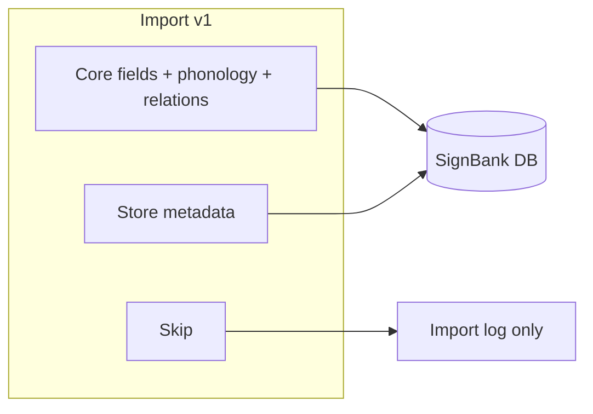
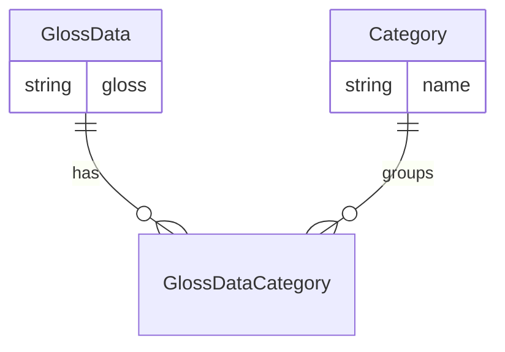
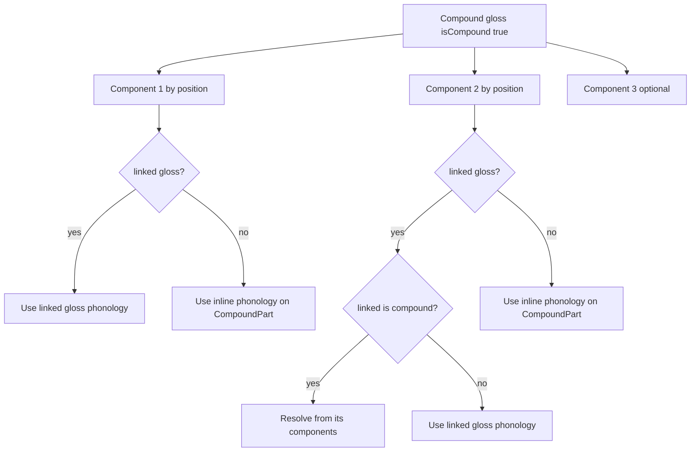
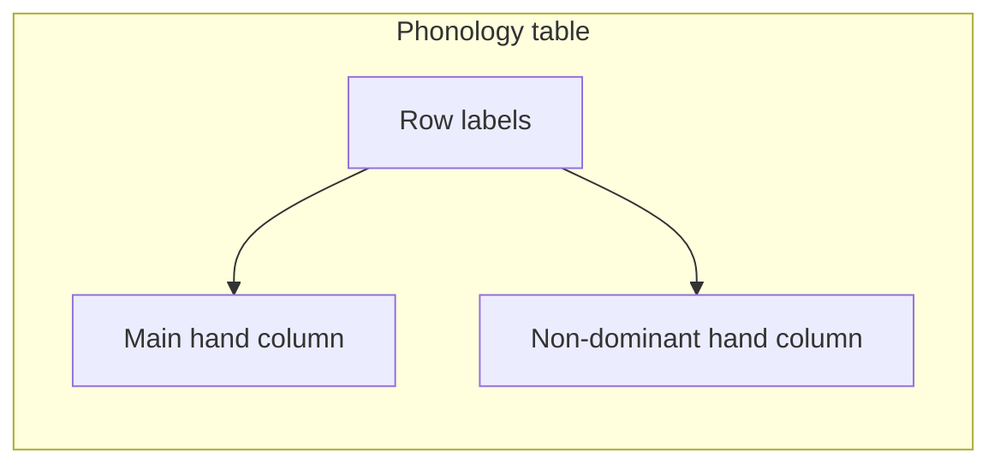

# SignBank — Fitxas import requirements

Consolidated reference for schema v2 fitxa JSON, meeting decisions, and required SignBank changes. This document supersedes the field-mapping and scope sections in [`fitxas-import-plan.md`](fitxas-import-plan.md).

**Last updated:** 2026-06-19 (extensible phonology configurations)  
**Status:** Post-meeting decisions captured  
**Sample data:** [`Examples/`](../Examples/) (`menjar.json`, `cervesa.json`, `bessons-1d.json`, `bessons.json`)  
**Raw meeting notes:** [`fitxas-import-meeting-agenda.md`](fitxas-import-meeting-agenda.md)  
**ENUM reference:** [`fitxas-import-enums-reference.md`](fitxas-import-enums-reference.md)

This document bridges domain decisions from the dictionary team with concrete implementation work in SignBank (schema, import pipeline, UI).

---

## 1. Schema v2 format

The sample files in `Examples/` use **schema v2** (`"schema_version": 2`). This replaces the field names described in earlier planning documents.

### 1.1 Field renames and structural changes

| Old (plan v1) | New (schema v2) | Notes |
|---------------|-----------------|-------|
| `id`, `name` | `gloss_id`, `gloss_name` | Primary identity |
| `tr_en`, `tr_es`, `tr_ca` | `translations.{english, spanish, catalan}` | May contain `;`-separated values |
| `alt_glosses` | `synonyms` | **Skip** — use `related_signs.*` only (see §2.2) |
| `is_compound`, `compound_signs`, `morfologia_sequencial` | `compound.{is_compound, components[]}` | See [§1.2](#12-compound-structure) |
| `phonology.configuracio` | `configuracio_ma_dominant` + `configuracio_ma_no_dominant` | Same split for `relacio_articuladors_ma_*` |
| `occ_general`, `occ_learning`, `occ_specific` | `occurrences.{general, learning, specific, web}` | Structured rows: `source`, `appears`, `gloss` |
| `video_url` | `video_urls[]` | `{url, source, description, thumbnail_url}` |
| `camp_semantic` | **removed** | Was duplicate of `categories` |
| `lexical_category` (root) | Still present in some fitxa files | **Skip on import** — category only from `definitions[]` prefix (§2.3) |
| — | `schema_version: 2` | Explicit version marker |
| — | `iec_metadata` | `{entry_id, entry_date, last_modified, contributor, status, notes}` |
| — | `annotations` | Present in v2; purpose undefined |

### 1.2 Compound structure

In schema v2, compounds are nested under `compound`. See [§2.5 Compound signs](#25-compound-signs-domain-model) for the full SignBank domain model.

```json
"compound": {
  "is_compound": true,
  "components": [
    {
      "ordinal": 1,
      "name": "GERMÀ",
      "comp_id": "0165_dona_germa",
      "redundant": true,
      "phonology": { ... }
    },
    {
      "ordinal": 2,
      "name": "SEGON",
      "comp_id": null,
      "redundant": false,
      "phonology": { ... }
    }
  ]
}
```

- A compound typically has **2–3 ordered components** (`ordinal` / `position`).
- Top-level `phonology` is **`null` for compounds** — phonology is never stored on the compound gloss itself; it is derived from the components (see §2.5).
- `comp_id` links to another fitxa's `gloss_id` when that morpheme has its own dictionary entry.
- `comp_id: null` means the morpheme is an **inline morpheme** — it has no standalone gloss entry but carries its own `phonology` block in the JSON.
- `redundant` marks morphemes that are phonologically subsumed by the compound.
- Per-component `phonology` in the JSON is the source for inline morphemes, or a fallback/cache when the linked gloss is not yet imported.

### 1.3 Phonology — per-hand fields

Schema v2 separates **dominant** (main) and **non-dominant** hand data. Example from `cervesa.json`:

```json
"phonology": {
  "nombre_mans": "2a",
  "configuracio_ma_dominant": "B (B)",
  "configuracio_ma_no_dominant": "0_SSI (O)",
  "relacio_articuladors_ma_dominant": "Damunt",
  "relacio_articuladors_ma_no_dominant": "Sota",
  ...
}
```

`nombre_mans` uses the fitxa taxonomy (`1`, `2a`, `2n`, `2s`, `x`) — distinct from SignBank's `Hand` enum (`RIGHT`, `LEFT`, `BOTH`).

#### Per-hand vs shared fields

| Scope | Fitxa fields |
|-------|--------------|
| **Per hand** | `configuracio_ma_dominant`, `configuracio_ma_no_dominant`, `relacio_articuladors_ma_dominant`, `relacio_articuladors_ma_no_dominant` |
| **Shared** (one value for the sign) | `localitzacio`, `orientacio_moviment`, `orientacio_localitzacio`, `canvi_orientacio`, `canvi_configuracio`, `tipus_contacte`, `forma_moviment`, `direccio_moviment`, `moviment_repetit`, `vocalitzacio`, `component_no_manual` |
| **Handedness** | `nombre_mans` — determines whether the two-hand table is shown |

When `nombre_mans` indicates a **multi-hand sign** (`2a`, `2n`, `2s`), SignBank must store and display phonology for **both hands**. See [§3.3 Phonology table](#phonology-table-ui--v1).

### 1.4 File layout variants

The import pipeline must accept both shapes:

| Layout | Files | Structure |
|--------|-------|-----------|
| Single-entry | `menjar.json`, `cervesa.json`, `bessons-1d.json` | Root object is one fitxa |
| Multi-entry bundle | `bessons.json` | Root object keyed by `gloss_id`, each value is a fitxa |

### 1.5 Fields unchanged in meaning

These fields keep the same role, only nested differently or renamed as above:

- `definitions[]`, `definition` (merged — do not import)
- `lexical_category` (top-level — **do not import**; see §2.3)
- `minimal_pairs[]`, `related_signs.*`
- `corpus_forms`, `categories`, `iconicity`, `valencia`, `signes_claus`
- `morfologia_simultania`, `morfologia_abreujada`
- `relacio_signes_forasters`, `entitat_amb_nom`
- `notes`, `iec_metadata`

---

## 2. Meeting decisions (resolved)

Decisions captured from [`fitxas-import-meeting-agenda.md`](fitxas-import-meeting-agenda.md) (2026-06-19).



### 2.1 Per-field decisions

| Field | Decision | Import | Display (v1) |
|-------|----------|--------|--------------|
| `synonyms` | Legacy / cross-corpus labels in fitxa JSON — **not imported** | **Skip** | — |
| `lexical_category` | Top-level gloss field in fitxa JSON — **not imported** | **Skip** | — |
| `corpus_forms` | LSC-corpus-specific surface forms (`MENJAR-rep`, `MENJAR-S'HO`, etc.) | **Store** | Hidden |
| `related_signs.*` | Dictionary relations (synonym, variant, antonym, …) | **Store** as `RelatedGloss` | Existing related-glosses UI — v1 |
| `relacio_signes_forasters` | Foreign/borrowed sign relations — not used yet | **Skip** | — |
| `categories` | Semantic field tags for grouping glosses (sports, health, food, family, …). `camp_semantic` removed from scraper as duplicate. | **Store** | v1 editor + gloss detail; search filter later |
| `occurrences.*` | Which dictionaries/materials contain the gloss — low relevance for SignBank | **Skip** | — |
| `iconicity` | Whether the sign form relates to a physical object or action (e.g. CAMINAR mimics walking). Fitxa: `"Sí"`, `"No"`, `"SÍ (2 germans)"`. | **Store** | Gloss detail — v1 |
| `valencia` | **Verb valency** (English: *valency* / transitivity) — how many arguments a verb takes (e.g. `"Verb transitiu"`). Catalan *valència* — not chemical valence. | **Store** | Gloss detail — v1 |
| `signes_claus` | **Key signs** — LSC definition via ordered gloss chains + optional comment ("signes necessaris per definir un signe"). | **Store** | Beside definitions — v1 |
| `morfologia_simultania` | **Simultaneous morphology** — morphemes performed at the same time (not sequential). | **Store** | Compound & morphology table — v1 |
| `morfologia_abreujada` | **Abbreviated / shortened morphology** — shortened compound forms. Meaning partly unclear; store and display. | **Store** | Compound & morphology table — v1 |
| `entitat_amb_nom` | **Named entity** — proper-name / entity reference for the sign. | **Store** | Compound & morphology table — v1 |
| `compound.*` | Sequential compound: morpheme chain, per-component phonology | **Store** | Compound & morphology table — v1 |

### 2.2 Related glosses (`related_signs` only)

SignBank implements relations via `RelatedGloss` — visible in gloss detail and editable in the related-glosses step ([`RelatedGlosses.vue`](../frontend/src/components/GlossDetail/components/RelatedGlosses.vue)).

**Do not import the fitxa `synonyms[]` field.** It is ignored. All sign-to-sign links come from `related_signs` only.

| Fitxa key | `RelationType` | Example (`MENJAR`) |
|-----------|----------------|-------------------|
| `SINÒNIM` | `SYNONYM` | *(empty in sample)* |
| `VARIANT` | `VARIANT` | `["CONSUM"]` |
| `ANTÒNIM` | `ANTONYM` | |
| `HOMÒNIM` | `HOMONYM` | |
| `HIPERÒNIM` | `HYPERNYM` | |
| `HIPÒNIM` | `HYPONYM` | |
| `VEURE TAMBÉ` | `ASSOCIATED_CONCEPT` | |

Import pass 2: resolve each target gloss string by name; log unresolved references.

The fitxa `synonyms[]` array (e.g. `ALIMENTACIÓ`, `ÀPAT` on `MENJAR`) is **discarded** — if those links matter, they must appear under the appropriate `related_signs.*` key in the source JSON.

### 2.3 Definitions and lexical category

Each gloss can have one or more definitions (`definitions[]` in the fitxa JSON). **Each definition carries an optional lexical category** (verb, noun, adjective, etc.) that labels the grammatical type of that sense.

#### Rules

| Rule | Detail |
|------|--------|
| **Per-definition, not per-gloss** | Lexical category belongs to each `Definition` row, not to the gloss as a whole. `MENJAR` has two senses: one Verb, one Nom. |
| **Optional** | A definition may have no lexical category. When absent, the UI hides the label — do not show an empty or default placeholder. |
| **Embedded in fitxa text** | Fitxa JSON encodes category as a prefix in each `definitions[]` string: `"Verb- Dur un aliment..."`, `"Nom- Producte natural..."`, `"Adj- Nat d'un mateix part..."`. |
| **Top-level `lexical_category`** | **Removed / not imported.** The fitxa root field (e.g. `"lexical_category": "Nom o verb"` on `MENJAR`) is ignored. Lexical category exists **only** on each `Definition` row, parsed from the definition string prefix. |
| **Import** | Parser strips the prefix → `Definition.lexicalCategory` enum; remaining text → `Definition.definition`. If no prefix, store text as-is and leave `lexicalCategory` null. Never read top-level `lexical_category`. |

#### Prefix → enum mapping (examples)

| Fitxa prefix | `LexicalCategory` |
|--------------|-------------------|
| `Verb-`, `verb` | `VERB` |
| `Nom-`, `nom` | `NOUN` |
| `Adj-`, `adjectiu` | `ADJECTIVE` |
| `Nom o verb` | `NOUN_OR_VERB` |
| `Adjectiu o nom` | `NOUN_OR_ADJECTIVE` |

Full mapping built during import by scanning unique values across the dataset. See [`fitxas-import-enums-reference.md`](fitxas-import-enums-reference.md).

#### Schema change required

Current `Definition.lexicalCategory` is **required** with `@default(NOUN)` in Prisma. This must change to **optional**:

```prisma
model Definition {
  // ...
  lexicalCategory  LexicalCategory?   // was required with @default(NOUN)
}
```

#### UI

- Show lexical category label next to each definition when set (e.g. "Verb", "Nom").
- When `lexicalCategory` is null, show only the definition text — no category badge.
- **No gloss-level lexical category field** in the UI — do not display or edit top-level `lexical_category` from the fitxa.

### 2.4 Semantic categories

Semantic categories group glosses by **topic or field** (e.g. sports, health, food, family). This is distinct from **lexical category** (§2.3), which describes grammatical type per definition (verb, noun).

Fitxa JSON provides categories as a string array on each gloss:

```json
"categories": ["Acte físic"]        // MENJAR
"categories": ["Aliment"]           // CERVESA
"categories": ["Família"]           // BESSONS-1d
```

#### Rules

| Rule | Detail |
|------|--------|
| **Many-to-many** | A gloss can have **multiple** categories. A category can be shared by **many** glosses. |
| **Normalized storage** | Categories are first-class entities in the database (`Category` table), not free-text arrays on `GlossData`. |
| **Open vocabulary** | Category names come from fitxa data and editor input (e.g. `Aliment`, `Família`, `Acte físic`). Not a closed enum — new labels can be added. |
| **Unique by name** | `Category.name` is unique (case-sensitive or normalized per implementation). Import uses find-or-create. |
| **Optional** | A gloss may have zero categories. |



#### UI (gloss editor — v1)

On gloss create/edit:

- **Multi-select** with **search**: user types to filter existing categories.
- **Select existing**: pick from categories already in the database.
- **Add new**: if the typed label does not exist, create it and attach to the gloss.
- Pattern: searchable combobox (`q-select` with `use-input`, `filter`, multi, and new-value or explicit "create" action).

On gloss detail (read-only): show category chips/tags.

**Search/browse by category** (dictionary search page) is a follow-up — store and editor support are v1.

**Phonology**

- Support dominant and non-dominant hand configuration separately — **required for multi-hand signs**.
- Schema v2 already provides per-hand fields; SignBank's `VideoData` and enum resolver do not yet.
- **UI:** side-by-side phonology table (dominant \| non-dominant columns) — see §3.3.
- **Compound glosses do not have their own phonology** — see §2.5.

### 2.5 Compound signs (domain model)

Compounds are a **v1 database and UI requirement**. SignBank must model them explicitly; the current schema has no compound support.

#### Rules

| Rule | Detail |
|------|--------|
| **No top-level phonology** | When `isCompound` is true, the gloss has no `VideoData` of its own. Top-level `phonology` in the fitxa JSON is `null`. |
| **2–3 ordered components** | A compound references other signs (or inline morphemes) in a fixed order. Example: `BESSONS-1d` = `GERMÀ` (1st) + `SEGON` (2nd) — "brother" + "second" → twins. |
| **Phonology from components** | Display and search phonology are assembled from the components, shown in **columns** (one column per component, in order). |
| **Linked gloss OR inline morpheme** | Each component is one of two types — not both required to be dictionary entries: |
| | **Linked gloss** — `comp_id` resolves to another `GlossData` row. Phonology is taken from that sign (or recursively from its components if it is also a compound). |
| | **Inline morpheme** — `comp_id` is `null`. No standalone gloss entry exists. Phonology is stored directly on the `CompoundPart` (from the embedded `phonology` block in the JSON). Example: `SEGON` in `bessons-1d.json`. |
| **Nested compounds** | A component may reference another compound gloss (a sign that is itself `isCompound: true`). Phonology resolves recursively from that compound's ordered components. |
| **Nesting depth** | Expected maximum ~2 levels; not confirmed 100%. Schema and resolver should allow nesting but log a warning when depth exceeds 2. |

#### Phonology resolution (display / import)



#### Example: `BESSONS-1d`

| Position | Name | Type | `comp_id` | Phonology source |
|----------|------|------|-----------|------------------|
| 1 | GERMÀ | Linked gloss | `0165_dona_germa` | From `GERMÀ` entry (or embedded fallback) |
| 2 | SEGON | Inline morpheme | `null` | Embedded `phonology` on the component |

UI shows: `GERMÀ + SEGON → BESSONS-1d` with two phonology columns.

#### Compound & morphology information table (UI — v1)

On gloss detail and in the editor, group the following in a **single compound / morphology section** (one information table or card group):

| Row / subsection | Fitxa field | When shown |
|----------------|-------------|------------|
| Sequential compound chain | `compound.*` | When `isCompound` or components exist |
| Columnar phonology | `compound.components[].phonology` | Per component, in order |
| Simultaneous morphology | `morfologia_simultania[]` | When non-empty |
| Abbreviated morphology | `morfologia_abreujada[]` | When non-empty |
| Named entity | `entitat_amb_nom` | When set |

Fitxa JSON shapes:

```json
"morfologia_simultania": [
  { "glossa_morfema": "Classificador descriptiu", "significat_en_aquest_signe": "Forma de l'aliment que es menja" }
],
"morfologia_abreujada": [
  { "glossa_abreujada": "…", "rol_en_aquest_signe": "…" }
],
"entitat_amb_nom": "…"
```

These fields are **not** limited to compound signs — `MENJAR` has simultaneous morphology but is not a compound. Still display them in the same table for consistency; hide empty subsections.

### 2.6 Gloss-level metadata (iconicity, valency, key signs)

Separate from the compound/morphology table — stored on the gloss and shown in gloss detail (v1).

#### Iconicity (`iconicity`)

Whether the sign's form is iconic — visually related to a physical object or action.

| Fitxa value | Meaning |
|-------------|---------|
| `"Sí"` | Iconic (e.g. CAMINAR — fingers mimic walking) |
| `"No"` | Not iconic |
| `"SÍ (2 germans)"` | Iconic, with explanatory note |

Store as nullable string on `GlossData.iconicity`.

#### Valency (`valencia`)

Catalan **valència** → English **verb valency** (also described as *transitivity* in the fitxa labels).

Indicates how the verb relates to its arguments — e.g. `"Verb transitiu"` (transitive: takes a direct object). Relevant mainly for verb senses; nullable for non-verbs.

Store as nullable string on `GlossData.valency`. Map values from fitxa text and XLSX `València` sheet during import.

#### Key signs (`signes_claus`)

LSC definitions expressed as **chains of gloss labels** plus an optional comment — the signs needed to define this sign in sign language.

```json
"signes_claus": [
  {
    "glosses": ["COSA", "ANIMAL", "VIURE", "FALTAR", "PER-A", "SALVAR", "SOBREVIURE"],
    "comment": null
  },
  {
    "glosses": ["TRAGAR", "ALIMENTO", "COMBUSTIBLE-XUCLAR"],
    "comment": "Proposta Lali …"
  }
]
```

- A gloss may have **multiple key-sign groups**.
- UI: show beside written definitions (not inside the compound table).
- Store as `KeySignGroup[]` with ordered `glosses: string[]` and optional `comment`.

### 2.7 Confirmed for v1 (unchanged from pre-meeting)

| Feature | Example |
|---------|---------|
| Compound indicator | `compound.is_compound: true` for `BESSONS-1d` |
| Morpheme chain (ordered) | `GERMÀ + SEGON → BESSONS-1d` |
| No compound phonology | Top-level `phonology: null`; derived from components |
| Columnar phonology | One column per component, in `ordinal` order |
| Inline morpheme support | `SEGON` with `comp_id: null` and embedded phonology |
| Nested compound reference | Component links to another `isCompound` gloss |
| Semantic categories | Many-to-many; searchable multi-select in editor |
| Iconicity, valency, key signs | Stored on gloss; shown in gloss detail |
| Compound & morphology table | Sequential compound + simultaneous + abbreviated + named entity |
| Two-hand phonology table | Dominant / non-dominant columns for multi-hand signs |

### 2.8 Explicitly out of scope for v1

| Field | Reason |
|-------|--------|
| `definition` (merged string) | Redundant with `definitions[]` |
| `occurrences.*` | Skipped per meeting decision |
| `relacio_signes_forasters` | Not used yet |
| `synonyms[]` | Not imported — use `related_signs.*` only |
| `lexical_category` (top-level) | Not imported — per-definition prefix only (§2.3) |
| `vocab_warnings` | Import-time log only (not in schema v2) |

---

## 3. Required SignBank changes

### 3.1 Prisma schema

Current [`backend/prisma/schema.prisma`](../backend/prisma/schema.prisma) has no models for fitxa-specific metadata or compounds. Proposed additions:

| Concept | Proposed model / field |
|---------|------------------------|
| Traceability | `GlossData.externalId` (`gloss_id`), `GlossData.sourceDocPath` |
| **Compounds** | `GlossData.isCompound`, `CompoundPart[]` — see below |
| **Semantic categories** | `Category` model + many-to-many with `GlossData` — see below |
| Related glosses | Existing `RelatedGloss` — import from `related_signs.*` only |
| Corpus forms | `CorpusForm[]` on `GlossData` |
| Iconicity | `GlossData.iconicity` (`String?`) — e.g. `"Sí"`, `"No"` |
| Valency | `GlossData.valency` (`String?`) — from fitxa `valencia`; verb transitivity / argument structure |
| Key signs | `KeySignGroup[]` — `glosses: string[]`, `comment?`; maps `signes_claus` |
| Named entity | `GlossData.namedEntity` (`String?`) — maps `entitat_amb_nom` |
| Simultaneous morphology | `SimultaneousMorphology[]` — `morphemeGloss`, `meaningInSign` |
| Abbreviated morphology | `AbbreviatedMorphology[]` — `abbreviatedGloss`, `roleInSign` |
| Handedness | `Handedness` enum on `VideoData` — from `nombre_mans` (`1`, `2a`, `2n`, `2s`, `x`) |
| Per-hand config | FK to `HandConfigurationEntry` catalog (dominant + non-dominant); articulator relations on `VideoData` — see §3.4 |
| **Hand configuration catalog** | `HandConfigurationEntry` — extensible labels + aliases; replaces closed `HandConfiguration` enum for new values |
| Shared phonology | Remaining `VideoData` fields (location, movement, contact, etc.) — single value per sign |
| **Definition lexical category** | Make `Definition.lexicalCategory` **optional** (`LexicalCategory?`) — remove `@default(NOUN)` |

**Semantic category model (v1 — required):**

```prisma
model Category {
  id      String      @id @default(uuid())
  name    String      @unique   // "Aliment", "Família", "Acte físic"
  glosses GlossData[]
}

model GlossData {
  // ... existing fields
  categories Category[]
}
```

- Import: for each string in fitxa `categories[]`, find-or-create `Category` by name and link to gloss.
- API: `GET /categories?search=` for combobox; `POST /categories` to create; attach via gloss update payload.

**Compound model (v1 — required):**

A compound gloss (`isCompound: true`) has **no `SignVideo` / `VideoData` of its own**. Phonology lives on the components.

Each `CompoundPart` is either a **linked gloss** or an **inline morpheme**:

| Component type | DB fields | Phonology |
|--------------|-----------|-----------|
| Linked gloss | `linkedGlossId` → `GlossData` (resolved from `comp_id` / `compExternalId`) | Resolved from linked gloss: if simple, use its `VideoData`; if compound, recurse into its `CompoundPart[]` |
| Inline morpheme | `linkedGlossId: null`, `inlinePhonology` → `VideoData` | Stored directly on the part (from JSON `phonology` block) |

```prisma
model GlossData {
  // ... existing fields
  externalId     String?  @unique
  sourceDocPath  String?
  isCompound     Boolean  @default(false)
  iconicity      String?
  valency        String?              // fitxa valencia — verb valency / transitivity
  namedEntity    String?              // fitxa entitat_amb_nom
  compoundParts  CompoundPart[]
  usedInCompounds CompoundPart[] @relation("CompoundPartLinkedGloss")
  categories     Category[]
  keySignGroups       KeySignGroup[]
  simultaneousMorphology SimultaneousMorphology[]
  abbreviatedMorphology  AbbreviatedMorphology[]
  // corpusForms — relations via RelatedGloss only (related_signs.*)
  // Note: when isCompound, do NOT attach SignVideo/VideoData to this gloss
}

model KeySignGroup {
  id          String    @id @default(uuid())
  glossDataId String
  glossData   GlossData @relation(fields: [glossDataId], references: [id], onDelete: Cascade)
  position    Int       @default(0)
  glosses     String[]  // ordered gloss labels
  comment     String?
}

model SimultaneousMorphology {
  id            String    @id @default(uuid())
  glossDataId   String
  glossData     GlossData @relation(fields: [glossDataId], references: [id], onDelete: Cascade)
  morphemeGloss String    // glossa_morfema
  meaningInSign String?   // significat_en_aquest_signe
}

model AbbreviatedMorphology {
  id              String    @id @default(uuid())
  glossDataId     String
  glossData       GlossData @relation(fields: [glossDataId], references: [id], onDelete: Cascade)
  abbreviatedGloss String?  // glossa_abreujada
  roleInSign      String?   // rol_en_aquest_signe
}

model CompoundPart {
  id              String     @id @default(uuid())
  glossDataId     String
  glossData       GlossData  @relation(fields: [glossDataId], references: [id], onDelete: Cascade)
  position        Int        // maps ordinal; 1, 2, or 3
  gloss           String     // display label: "GERMÀ", "SEGON"
  compExternalId  String?    // fitxa comp_id for import traceability
  linkedGlossId   String?    // FK when component references another gloss
  linkedGloss     GlossData? @relation("CompoundPartLinkedGloss", fields: [linkedGlossId], references: [id])
  redundant       Boolean    @default(false)
  inlinePhonology VideoData? // phonology when linkedGlossId is null (inline morpheme)
}
```

**Constraints:**

- `isCompound: true` → must have 2–3 `CompoundPart` rows with unique `position` values.
- `isCompound: false` → no `CompoundPart` rows; phonology on `SignVideo` / `VideoData` as today.
- Nesting: `linkedGloss` may point to another `isCompound` gloss; resolver recurses (warn if depth > 2).

Fields **not** in v1 schema: `occurrences`, `relacio_signes_forasters`, `synonyms`, top-level `lexical_category`.

### 3.2 Import pipeline

Planned script: [`backend/scripts/import-fitxas.ts`](../backend/scripts/import-fitxas.ts) (not yet created).

| Task | Detail |
|------|--------|
| TypeScript interface | Schema v2 fitxa shape; support single-entry and bundle layouts |
| Field mappers | Use v2 names (`gloss_name`, `translations.english`, `compound.components`, etc.) |
| Enum resolver update | [`backend/src/import/fitxa-enum-resolver.ts`](../backend/src/import/fitxa-enum-resolver.ts) currently maps legacy `configuracio` / `relacio_articuladors` — must handle `configuracio_ma_dominant`, `configuracio_ma_no_dominant`, `relacio_articuladors_ma_*`, and `nombre_mans` → `Handedness` |
| Definition parser | Extract optional `Verb-` / `Nom-` / `Adj-` prefix from each `definitions[]` entry → `Definition.lexicalCategory`; strip prefix from text. Leave `lexicalCategory` null when no prefix. **Skip** top-level `lexical_category`. |
| Compound resolver | Resolve `comp_id` → `linkedGlossId`; when `comp_id` is null, map embedded `phonology` → `inlinePhonology` on `CompoundPart`. Do not create top-level `VideoData` when `isCompound`. Recurse when linked gloss is itself compound (warn if depth > 2). |
| Category mapper | For each `categories[]` string: find-or-create `Category` by name; link to gloss (many-to-many) |
| Metadata mapper | `iconicity`, `valencia` → `valency`, `entitat_amb_nom` → `namedEntity`, `signes_claus` → `KeySignGroup[]`, morphology arrays → `SimultaneousMorphology[]` / `AbbreviatedMorphology[]` |
| Two-pass import | Pass 1: create glosses; pass 2: resolve `related_signs.*` and `minimal_pairs` by gloss name → `RelatedGloss` / `MinimalPair` |
| Dry-run report | Per-file summary: stored vs skipped vs unmapped enum warnings |

**Core field mapping (schema v2 → SignBank):**

| Fitxa field | SignBank target |
|-------------|-----------------|
| `gloss_name` | `GlossData.gloss` |
| `gloss_id` | `GlossData.externalId` |
| `translations.*` | `GlossTranslation` |
| `definitions[]` | `Definition[]` — optional `lexicalCategory` per row (parse prefix only) |
| `lexical_category` (top-level) | **Skip** — not imported |
| `phonology` | `VideoData` on `SignVideo` — **only when `isCompound` is false** |
| `compound.*` | `isCompound` + ordered `CompoundPart[]` (linked gloss or inline phonology) |
| `minimal_pairs[]` | `MinimalPair` |
| `related_signs.*` | `RelatedGloss` (all relation types) |
| `synonyms[]` | **Skip** — not imported |
| `notes` | `GlossData.editComment` |
| `video_urls[]` | `Video.url` (after Drive → Dufs) |
| `categories[]` | `Category` many-to-many (find-or-create by name) |
| `iconicity` | `GlossData.iconicity` |
| `valencia` | `GlossData.valency` |
| `signes_claus` | `KeySignGroup[]` |
| `entitat_amb_nom` | `GlossData.namedEntity` |
| `morfologia_simultania` | `SimultaneousMorphology[]` |
| `morfologia_abreujada` | `AbbreviatedMorphology[]` |
| `corpus_forms` | `CorpusForm[]` (hidden in UI for now) |

**Relation type mapping:**

| Fitxa key | `RelationType` |
|-----------|----------------|
| `SINÒNIM` | `SYNONYM` |
| `ANTÒNIM` | `ANTONYM` |
| `HOMÒNIM` | `HOMONYM` |
| `VARIANT` | `VARIANT` |
| `HIPERÒNIM` | `HYPERNYM` |
| `HIPÒNIM` | `HYPONYM` |
| `VEURE TAMBÉ` | `ASSOCIATED_CONCEPT` |

### 3.3 UI (gloss detail)

#### Phonology table (UI — v1) {#phonology-table-ui--v1}

When a gloss uses **multiple hands** (`nombre_mans` is `2a`, `2n`, or `2s`), phonology is shown as a **table** with configuration labels on the left and **two value columns side by side**:

| | **Main hand** (dominant) | **Non-dominant hand** |
|---|--------------------------|------------------------|
| Hand configuration | `B (B)` | `0_SSI (O)` |
| Relation between articulators | Damunt | Sota |
| Location | *(shared)* | *(shared)* |
| … | … | … |

**Layout rules:**

| Rule | Detail |
|------|--------|
| **Column headers** | Main hand (dominant) \| Non-dominant hand — fixed labels, side by side |
| **Row labels** | Left column: human-readable field names (configuration, relation between articulators, location, …) |
| **Per-hand rows** | Different value in each hand column (configuration, articulator relation) |
| **Shared rows** | Single value shown once (span both columns or repeat in both — implementer choice; prefer one merged cell) |
| **Single-hand signs** | When `nombre_mans` is `1`, show **main hand column only** — hide non-dominant column |
| **Editor** | Same table layout in gloss create/edit forms |
| **Compounds** | Each component in the compound phonology block uses this table when that component is multi-hand |

Example reference: `cervesa.json` (`nombre_mans: "2a"`, dominant `B (B)` / non-dominant `0_SSI (O)`).



#### Compound & morphology information table (v1)

Single section grouping:

| Subsection | Content |
|------------|---------|
| Sequential compound | Badge, ordered morpheme chain (`GERMÀ + SEGON → BESSONS-1d`), columnar phonology per component (each column may use the phonology table when multi-hand) |
| Simultaneous morphology | Rows from `morfologia_simultania` (morpheme + meaning) |
| Abbreviated morphology | Rows from `morfologia_abreujada` (abbreviated gloss + role) |
| Named entity | `entitat_amb_nom` when set |

Hide empty subsections. Shown for any gloss that has data — not only when `isCompound`.

#### Other gloss detail (v1)

| Feature | Priority | Notes |
|---------|----------|-------|
| Two-hand phonology table | v1 | Label column + main hand + non-dominant hand; configuration from catalog when available |
| Linked gloss vs inline morpheme | v1 | Link to gloss detail when `linkedGlossId` set; show inline phonology otherwise |
| Nested compound resolution | v1 | Recurse phonology when component links to another compound |
| Key signs | v1 | Beside written definitions — gloss chains + comment per group |
| Iconicity | v1 | Label or text from `iconicity` |
| Valency | v1 | Label from `valency` (e.g. "Verb transitiu") — mainly for verbs |
| Optional lexical category per definition | v1 | Show label (Verb, Nom, …) when set; hide when null |
| Semantic categories (editor) | v1 | Searchable multi-select: pick existing or create new category |
| Semantic categories (gloss detail) | v1 | Display category chips |
| Search filter by category | Later | Typesense facet once categories are indexed |
| Corpus forms | Hidden | Admin-only or future |

### 3.4 Phonology vocabulary — extensibility & mapping

#### Extensible hand configurations (DB + code — required)

Fitxa phonology uses **human-readable labels** (`B (B)`, `Q (Beak)`, `T_antiga (Money)`, `0_SSI (O)`, …). SignBank today stores hand configuration as a **closed Prisma enum** (`HandConfiguration`: `CONF_1` … `CONF_40`, Unicode variants) with labels hardcoded in frontend i18n ([`phonology.ts`](../frontend/src/i18n/ca-ES/phonology.ts)).

**Problem:**

| Limitation | Impact |
|------------|--------|
| New fitxa labels not in enum / mappings | Import maps to `EMPTY` + warning ([`fitxas-mapping-analysis.json`](fitxas-mapping-analysis.json): 6 xlsx config rows without `signbankId`) |
| Adding enum value | Requires Prisma migration + backend + frontend i18n + Typesense schema update |
| Per-hand fields (§1.3) | Dominant and non-dominant each need a configuration — vocabulary must scale |

**Requirement:** Ability to **add new phonology hand configurations** without a full application redeploy for every new label from the dictionary team.

**Proposed direction (catalog table):**

Move hand configuration from a fixed enum to a **database catalog** (other phonology dimensions may follow later; start with configuration):

```prisma
model HandConfigurationEntry {
  id           String   @id @default(uuid())
  code         String   @unique   // stable key, e.g. CONF_33 or generated slug
  labelCa      String?
  labelEn      String?
  aliases      String[]           // fitxa labels: "q (beak)", "b (b)", …
  externalId   String?            // xlsx ID_CONFIGURACIO when present
  active       Boolean  @default(true)
}

model VideoData {
  // replace HandConfiguration enum fields with FK or code string:
  dominantConfigurationId     String?
  dominantConfiguration       HandConfigurationEntry? @relation(...)
  nonDominantConfigurationId  String?
  nonDominantConfiguration    HandConfigurationEntry? @relation(...)
}
```

| Layer | Change |
|-------|--------|
| **DB** | `HandConfigurationEntry` catalog; `VideoData` references catalog (migration from enum) |
| **Import** | `resolveFitxaEnum('configuration', label)` → lookup catalog by alias; if missing, **create pending entry** or queue for admin review |
| **API** | `GET /phonology/configurations?search=` for editor combobox; `POST` (admin) to add configuration + aliases |
| **UI** | Phonology editor (§3.3 two-hand table): searchable select — pick existing or **add new configuration** (admin / editor flow TBD) |
| **Typesense** | Index configuration codes/labels for search facets — update when catalog changes |
| **Seed / migrate** | One-time import of current `HandConfiguration` enum values + xlsx `Configuracions` sheet into catalog |

**Interim (before catalog migration):** Continue [`fitxa-enum-mappings.json`](../backend/src/import/fitxa-enum-mappings.json) + manual alias updates — not sufficient long term.

> **Status:** Needs design session — enum-to-catalog migration is a breaking schema change. Plan alongside Phase 1 per-hand `VideoData` fields.

#### Enum mapping gaps (current pipeline)

[`fitxas-enum-mappings.md`](fitxas-enum-mappings.md) and [`fitxas-mapping-analysis.json`](fitxas-mapping-analysis.json) still need wiring for:

- Per-hand configuration (`configuracio_ma_dominant`, `configuracio_ma_no_dominant`)
- `nombre_mans` → `Handedness` (distinct from `Hand` enum)
- XLSX sheets not yet connected: `Etiquetes-Tags`, `València`, `Entitat_amb_nom_named_entity`, `Morfologia seqüencial`
- Combined values like `B (B) / O_SSI (O)` need split logic (v1 used single `configuracio` field)

Regenerate ENUM reference: `node backend/scripts/generate-enum-reference.js`

### 3.5 Admin fitxa import page (UI — planned, complex)

> **Status:** Noted for planning only. **Do not implement in passing** — this feature is complex and will need a **dedicated implementation session with active prompting** (step-by-step UX, API contract, error handling, and edge cases).

An **admin-only** page in the Vue frontend where authorised users upload fitxa JSON files and import them into the database.

#### Access

| Rule | Detail |
|------|--------|
| **Role** | `ADMIN` only (reuse existing auth guards / `RolesGuard`) |
| **Route** | New admin route (e.g. `/admin/import-fitxas`) — not linked for regular users |

#### Core behaviour

| Capability | Detail |
|------------|--------|
| **Multi-file upload** | Admin selects or drops **multiple** `.json` files in one session |
| **Format support** | Single-entry fitxa per file (`menjar.json`) and multi-entry bundles (`bessons.json`) |
| **Parse & import** | Server parses schema v2 JSON and writes to PostgreSQL via the import pipeline |
| **Batch** | Process all uploaded files; report per-file and per-gloss outcomes |

#### Why this is complex (defer detailed design)

Likely sub-features that need explicit design before coding:

- **Dry-run vs commit** — preview warnings before writing to DB
- **Upsert** — update existing glosses matched by `gloss_id` / `externalId`
- **Two-pass relations** — `related_signs` and `minimal_pairs` resolved after all glosses exist
- **Per-file / per-gloss error report** — unmapped phonology, missing relation targets, invalid JSON
- **Progress & cancellation** — long-running batch for hundreds of files
- **Publication mode** — draft vs published (ties to open publication workflow decision)
- **Videos** — optional Drive download or skip video fields on first import
- **Backend surface** — NestJS import module + REST endpoint(s) vs wrapping CLI script; file upload size limits

#### Dependencies

Must exist (or be stubbed) before the UI page:

1. Phase 1 schema migration
2. Import service / API (extracted from `import-fitxas` script logic)
3. Auth: admin role on import endpoints

#### Implementation note

When starting this work, use **focused prompts** per slice, for example:

1. Import API endpoint + DTOs + admin guard  
2. Upload component (multi-file, validation)  
3. Dry-run results panel  
4. Commit import + progress  
5. Error / warning report download  

Do not attempt full page + backend + import logic in a single pass.

### 3.6 Gloss edit & create pages (UI — major rework planned)

> **Status:** Noted for planning. The current gloss create/edit flow predates fitxa import requirements and must be **extended significantly**. Treat as a **multi-session effort** alongside Phase 1 schema and API work — not a quick add-on.

#### Affected pages & components

| Path | Role today |
|------|------------|
| [`CreateGlossRequest.vue`](../frontend/src/pages/CreateGlossRequest.vue) | Create flow — **gloss name only**, then redirect to edit |
| [`EditGlossRequest.vue`](../frontend/src/pages/EditGlossRequest.vue) | Draft request editing |
| [`GlossPage.vue`](../frontend/src/pages/GlossPage.vue) | Published gloss view + edit |
| [`MoreContentComponent.vue`](../frontend/src/components/GlossDetail/components/MoreContentComponent.vue) | Edit stepper: definitions → videos → optional (examples, relations) |
| [`GlossDetailComponent.vue`](../frontend/src/components/GlossDetail/GlossDetailComponent.vue) | Shared detail / edit shell |
| [`SignFonologyComponent.vue`](../frontend/src/components/GlossDetail/components/SignFonologyComponent.vue) | Phonology editor — **single-hand** `PhonologyData` only |
| [`DefinitionsComponent`](../frontend/src/components/GlossDetail/components/DefinitionsComponent/) | Definitions — lexical category **required**, defaults to `NOUN` |

#### Gaps vs fitxa requirements

| Requirement (this doc) | Current UI |
|------------------------|------------|
| Optional lexical category per definition (§2.3) | Required select; always shows category |
| Two-hand phonology table (§3.3) | Single configuration per `VideoData`; no dominant / non-dominant columns |
| Semantic categories multi-select (§2.4) | Not present |
| Compound & morphology table (§2.5, §3.3) | Not present — no compound parts, simultaneous / abbreviated morphology, named entity |
| Key signs, iconicity, valency (§2.6) | Not present |
| Compound glosses (no top-level phonology) | Assumes every gloss has `SignVideo` + phonology |

#### Planned improvements (v1 editor)

Extend the edit stepper (or reorganise into sections/tabs) to support:

| Section | Edit capabilities |
|---------|-------------------|
| **Definitions** | Optional lexical category; hide when empty |
| **Semantic categories** | Searchable multi-select; create new category inline |
| **Gloss metadata** | Iconicity, valency (optional fields) |
| **Key signs** | Add/edit groups: ordered gloss list + comment |
| **Phonology** | Two-hand table when multi-hand; configuration picker backed by extensible catalog (§3.4) |
| **Compound & morphology** | Compound parts (linked gloss or inline morpheme), simultaneous morphology, abbreviated morphology, named entity — same table as read-only detail |
| **Videos** | Existing flow; adapt validation when `isCompound` (no top-level phonology required) |

Read-only **detail view** (`MainContent.vue`) must mirror the same sections so imported fitxas display correctly.

#### Dependencies

1. **Phase 1** — Prisma models and fields on `GlossData`, `Definition`, `VideoData`, etc.
2. **Backend API** — CRUD payloads extended for new fields (gloss-data service, DTOs)
3. **Frontend types** — [`models.ts`](../frontend/src/types/models.ts) `GlossData`, `PhonologyData` updated
4. **Validation** — [`glossValidation.ts`](../frontend/src/utils/glossValidation.ts) rules for compounds vs simple signs

#### Implementation note

Break into focused slices (similar to §3.5):

1. Types + API client for new fields  
2. Definitions: optional lexical category  
3. Semantic categories combobox  
4. Phonology two-hand table (editor + read-only)
5. Extensible hand configuration catalog + admin/API (§3.4)
6. Compound & morphology editor block
7. Key signs + iconicity + valency
8. Stepper / layout reorganisation + validation updates

The create page may stay minimal (name only) or gain an early categories/metadata step — decide when implementing.

---

## 4. Still open

| # | Question | Owner |
|---|----------|-------|
| 1 | `morfologia_abreujada` — exact domain meaning | Ask Lali (store and display regardless) |
| 2 | Publication workflow (direct / draft / hybrid) | SignBank team |
| 3 | Video pipeline (Drive download vs pre-exported files) | SignBank team |
| 4 | `nombre_mans` vs existing `Hand` enum semantics | Technical — may keep both fields |
| 5 | `annotations` field purpose | Domain |
| 6 | Maximum compound nesting depth (expected ~2, not confirmed) | Domain — implement with soft warning at depth > 2 |
| 7 | Dictionary search filter by semantic category | Later — after editor + import |
| 8 | Admin fitxa import page — full UX and API contract | Dedicated implementation session; see §3.5 |
| 9 | Gloss edit/create pages — full rework for new fields | Multi-session; see §3.6 |
| 10 | Hand configuration catalog vs Prisma enum migration | Technical — see §3.4 |

---

## 5. Implementation phases

| Phase | Scope |
|-------|-------|
| **1 — Schema** | Migration: compounds, metadata, per-hand phonology, handedness, traceability; **hand configuration catalog** (§3.4) |
| **2 — Dry-run importer** | Schema v2 `Examples/`; no DB writes; gap report |
| **3 — Full import** | DB writes, relation pass, optional video pipeline |
| **4 — UI** | Gloss detail + **edit/create page rework** (§3.6): phonology table, compounds, categories, metadata |
| **5 — Production** | Full dataset dry-run → staging import → spot-check → Typesense sync → production with backup |
| **6 — Admin import UI** | Admin-only page: multi-file JSON upload, parse, dry-run preview, import — **complex; needs active prompting** (§3.5) |

See [`fitxas-import-plan.md`](fitxas-import-plan.md) for architecture, CLI flags, and technical hard problems (phonology mapping, videos, relations, publication workflow).

---

## 6. Sample file reference

### `menjar.json` — multi-sense, metadata-rich

- 2 definitions (Verb + Nom) with embedded category prefixes
- `synonyms[]`: present in JSON but **skipped** on import; relations from `related_signs.VARIANT`: `["CONSUM"]`
- `categories`: `["Acte físic"]`
- `morfologia_simultania`: descriptive classifier
- `signes_claus`: 2 groups with gloss lists and comments
- `related_signs.VARIANT`: `["CONSUM"]`
- `minimal_pairs`: `EMPASSAR-SE`
- Phonology: single hand (`nombre_mans: "1"`)

### `cervesa.json` — two-hand phonology

- Single definition (Nom)
- `nombre_mans: "2a"` — triggers two-hand phonology table in UI
- Per-hand: `B (B)` / `0_SSI (O)` configuration; `Damunt` / `Sota` articulator relations
- Shared: location, orientation, contact, movement direction, repeated movement
- 2 minimal pairs (one with uncertain distinction)

### `bessons-1d.json` — compound sign

- `compound.is_compound: true`; top-level `phonology: null`
- Ordered components: `GERMÀ` (position 1, linked via `comp_id`) + `SEGON` (position 2, inline morpheme, `comp_id: null`)
- Demonstrates both component types: linked gloss and inline phonology-only morpheme
- `related_signs.VARIANT`: `["BESSONS-T_antiga"]`

### `bessons.json` — multi-entry bundle

- Contains `BESSONS-T_antiga` and `BESSONS-1d` as sibling entries
- Demonstrates variant relation between compound and non-compound forms

---

## Related docs & code

| Resource | Path |
|----------|------|
| Implementation plan | [`fitxas-import-plan.md`](fitxas-import-plan.md) |
| Meeting agenda (raw notes) | [`fitxas-import-meeting-agenda.md`](fitxas-import-meeting-agenda.md) |
| ENUM mapping workflow | [`fitxas-enum-mappings.md`](fitxas-enum-mappings.md) |
| ENUM reference | [`fitxas-import-enums-reference.md`](fitxas-import-enums-reference.md) |
| Gap analysis | [`fitxas-mapping-analysis.json`](fitxas-mapping-analysis.json) |
| Prisma schema | [`backend/prisma/schema.prisma`](../backend/prisma/schema.prisma) |
| Enum resolver | [`backend/src/import/fitxa-enum-resolver.ts`](../backend/src/import/fitxa-enum-resolver.ts) |
| Sample data | [`Examples/`](../Examples/) |
